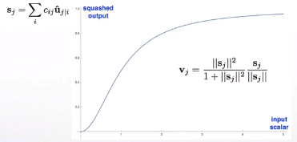
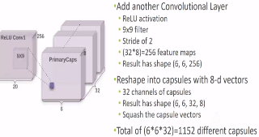

​	一个 capsule 是一组神经元，capsule activity vector 表示特定类型的实体（例如对象或对象部分）的实例化参数。activity vector的长度来表示实体存在的概率，方向表示实例化参数。前一层capsule通过转换矩阵对下一层capsule的实例化参数进行预测。该网络相比于CNN，对于重叠的目标，识别效果更好且能分离出重叠目标。算法使用 iterative routing-by-agreement mechanism，高层级的capsule的activity vector的计算过程将接收低层capsule的计算结果。

​	相比于CNN，Caps Net用vector-output capsules代替CNN的scalar-output feature detectors，并使用routing-by-agreement代替max-pooling

### Motivation

​	人的视觉系统通常之关注图像中很小部分的重要信息，这部分信息视觉系统通过高分辨率处理，而其他不重要的信息常常就忽略掉。

​	处理这部分重要信息的模型，文章叫做single fixation。假设single fixation可以提取的信息不仅仅是某一个事物的特征，而是某一个类型的特征信息，并且在建模过程中忽略每一个fixation之间相互左右的规律。只要求模型解析出每一个single fixation。

​	一个capsule代表图像中一个部分的目标信息，并且文章中提到“感知拥挤“的研究，来支撑 一个capsule只代表一个目标信息的合理性。


​	capsule可以代表目标的很多信息，文章将capsule输出vector的长度约束在1以内，代表存在概率；vector的方向代表目标的特征。

​	capsule的学习的信息具有一种全局的相关性。这样可以解决以下的问题。CNN倾向于局部特征的检测，整体上的空间关系对其预测结果的影响较小。实际上不是人脸的照片，在此处都检测为正确。


---

### Vector inputs and outputs of a capsule

​	根据长度代表出现概率的思路，文章提出了以下“激活函数”：
$$
\mathbf{v}_{j}=\frac{\left\|\mathbf{s}_{j}\right\|^{2}}{1+\left\|\mathbf{s}_{j}\right\|^{2}} \frac{\mathbf{s}_{j}}{\left\|\mathbf{s}_{j}\right\|}
$$

$$
\mathbf{s}_{j}=\sum_{i} c_{i j} \hat{\mathbf{u}}_{j | i}, \quad \hat{\mathbf{u}}_{j | i}=\mathbf{W}_{i j} \mathbf{u}_{i}
$$




​	输出将确保short vectors长度趋于0，long vectors长度趋于1。角度代表的信息由矩阵变换和低层不同特征的向量加权求和得到。

​	u来自低层级的capsule的输出。$c_{ij}$由iterative dynamic routing process计算。$b_{ij}$首先作为log先验概率初始化，在每一步迭代中更新概率。
$$
c_{i j}=\frac{\exp \left(b_{i j}\right)}{\sum_{k} \exp \left(b_{i k}\right)}
$$
​	$c_{ij}$相当于CNN中max pooling干的事。感觉有点像attention，iterative attention。


​	这种“routing-by-agreement”应该比通过max-pooling实现的非常原始的路由形式更加有效。后者可以使一层中的神经元忽略该层中除了最活跃的特征之外的所有特征。前者层层迭代，层层parsing，信息损失自然更少。

​	之后，Hinton又提出了EM routing[Matrix capsules with EM routing. ICLR (2018)]。 通过计算Existence probability和概率分布完成不同层间的计算，简单示意图如下。[code reference](https://github.com/yl-1993/Matrix-Capsules-EM-PyTorch)


#### max-pooling problem

​	max-pooling还存在以下问题：

 1. 甚至不能区分左和右

 2. 对rotation不敏感，不能学习到方向信息

 3. 一次只能‘看到’一个object

 4. max-pooling只做到spatial invariance

    ​	 

    而不能做到spatial equivariance

    

    capsule net通过：

    

    计算下一层capsule经过W变换后的u，进行组合，得到不同的结果。错误的预测route被裁剪(pruned)，是模型具有一定的spatial equivariance。

    

---

### Margin loss for digit existence

​	分别对每个类别计算损失，同时注意只有capsule对应的部分出现某类目标，才计算损失。
$$
L_{k}=T_{k} \max \left(0, m^{+}-\left\|\mathbf{v}_{k}\right\|\right)^{2}+\lambda\left(1-T_{k}\right) \max \left(0,\left\|\mathbf{v}_{k}\right\|-m^{-}\right)^{2}
$$
​	$T_k$只有在class k出现的时候等于1。
$$
m^{+}=0.9 \text { and } m^{-}=0.1
$$
​	$\lambda$是为了防止限制vector长度后，在训练开始阶段由于没有识别到目标导致的学习停滞问题，取0.5。总体存在性检测loss是所有类别capsule的损失之和。

​	整体损失，还要加上capsule重构图像特征的损失。


---

### CapsNet architecture




​	32个capsule，每个8维。


​	转换后，每个class capsule16维，不同而维度影响重构图像的不同特征。

​	routing-by-agreement的迭代过程就是不同的route squash结果进行裁剪的过程，计算结果相差大的route逐渐被移除。


​	EM route则是计算primry结果和route squash结果分布的差异。


​	capsule输出vector的长度约束在1以内，代表存在概率；vector的方向代表目标的特征。

​	其中每个capsule的转化矩阵都是独立的不同的，每个class对应一个capsule。

​	A simple CapsNet with 3 layers. PrimaryCaps计算第一层capsules的输入， DigitCaps计算部分使用iterative dynamic routing，计算输出capsules。


​	重构图像网络，采用训练好的DigitCaps，在此基础上训练重构网络，计算图像特征重构损失。只需要将true label的capsule提取出来进行重构计算即可。因此，多个数字重合的重构也能实现。

---

###  Code

​	重要的网络构建代码如下，[完整代码]()

​	Caps Net训练相对于CNN慢很多，并且只使用一层dynamic routing，参数量也更大，batch size相比CNN也要取得小一些，在相同条件下。

​	网络收敛比较快，而且计算过程损失的变化相对稳定。下图为第一轮训练结果。


​	第二轮计算结果


​	相关layer定义，以下代码参考了 https://github.com/XifengGuo/CapsNet-Pytorch ，https://github.com/naturomics/CapsNet-Tensorflow.git。在其上修改了写网络计算过程。

```python
import torch
import torch.nn as nn
import torch.nn.functional as F
from torch.autograd import Variable


def squash(inputs, axis=-1):
    """capsule输出的激活函数"""
    norm = torch.norm(inputs, dim=axis, keepdim=True)
    scale = norm ** 2 / (1 + norm ** 2) / (norm + 1e-8)
    return scale * inputs


class PrimaryCaps(nn.Module):
    """计算第一层capsules的输入，转换成32*6*6个8维的capsule vector
    in_channels：原文中256
    out_channels：卷积后的通道数，原文中256
    dim_caps: PrimaryCaps输出的每个capsule的维度
    kernel_size：原文中9 * 9
    stride：2
    """
    def __init__(self, in_channels, out_channels, dim_caps, kernel_size, stride=1, padding=0):
        super(PrimaryCaps, self).__init__()
        self.dim_caps = dim_caps
        self.conv2d = nn.Conv2d(in_channels,
                                out_channels,
                                kernel_size=kernel_size,
                                stride=stride,
                                padding=padding)

    def forward(self, input):
        """转换成32*6*6个8维的capsule vector, output size=[batch_size, num_caps, dim_caps]"""
        output = self.conv2d(input)
        output = output.view(input.size(0), -1, self.dim_caps)
        return squash(output)


class DenseCaps(nn.Module):
    """iterative dynamic routing计算capsule目标识别结果vector。
    input size = [None, in_num_caps, in_dim_caps]，
    output size = [None, out_num_caps, out_dim_caps]。

    in_num_caps: 第一层的输入capsule数量，32*6*6
    in_dim_caps：第一层的输入capsule维度，8
    out_num_caps：iterative dynamic routing时及输出的capsule数量，10
    out_dim_caps：iterative dynamic routing时及输出的capsule维度，16
    iterations：dynamic routing轮次
    weight：由32*6*6个8维的capsule vector计算10个16维的capsule vector的transform matrix，在每个[6 * 6]
            单元内的capsule是共享权重的。
    """
    def __init__(self, in_num_caps, in_dim_caps, out_num_caps, out_dim_caps, iterations=3):
        super(DenseCaps, self).__init__()
        self.in_num_caps = in_num_caps
        self.in_dim_caps = in_dim_caps
        self.out_num_caps = out_num_caps
        self.out_dim_caps = out_dim_caps
        self.iterations = iterations
        self.weight = nn.Parameter(0.01 * torch.randn(1,
                                                      in_num_caps,
                                                      out_num_caps * out_dim_caps,
                                                      in_dim_caps,
                                                      1))

    def forward(self, u):
        """u_hat在不同layer的capsules之间传递，每层capsules只能是才c，b在更新。文中结构只接上了一层
        dynamic routing capsules layer。"""
        # self.weight * u
        #     [1    , in_num_caps, out_num_caps * out_dim_caps, in_dim_caps, 1]
        #     [batch, in_num_caps, out_num_caps * out_dim_caps, in_dim_caps, 1]
        # =>> [batch, in_num_caps, out_num_caps * out_dim_caps, in_dim_caps, 1]
        # 按元素相乘，然后在reduce sum
        u_hat = u[:, :, None, :, None]
        u_hat = self.weight * u_hat.repeat(1, 1, self.out_num_caps * self.out_dim_caps, 1, 1)
        u_hat = torch.sum(u_hat, dim=3)
        # [batch, in_num_caps, out_num_caps, out_dim_caps]
        u_hat = torch.squeeze(u_hat.view(-1,
                                         self.in_num_caps,
                                         self.out_num_caps,
                                         self.out_dim_caps,
                                         1))
        u_hat_for_route = u_hat.detach()

        # coupling coefficient initialize
        # [batch, in_num_caps, out_num_caps]
        b = Variable(torch.zeros(u.size(0), self.in_num_caps, self.out_num_caps)).cuda()
        for i in range(self.iterations):
            c = F.softmax(b, dim=2)  # [batch, in_num_caps, out_num_caps]
            if i < self.iterations - 1:
                # u   [batch, in_num_caps, out_num_caps, out_dim_caps]
                # c   [batch, in_num_caps, out_num_caps, 1]
                # =>> [batch, 1, out_num_caps, out_dim_caps]
                outputs = squash(torch.sum(torch.unsqueeze(c, 3) * u_hat_for_route, dim=1, keepdims=True))
                b = b + torch.sum(outputs * u_hat_for_route, dim=-1)
            else:
                # 此时进入bp计算
                outputs = squash(torch.sum(torch.unsqueeze(c, 3) * u_hat, dim=1, keepdims=True))

        # [batch, out_num_caps, out_dim_caps]
        return torch.squeeze(outputs, dim=1)


def caps_loss(y_true, y_pred, x, x_reconstruct, lamada):
    """Capsule loss = Margin loss + lamada * reconstruction loss.
    y shape [batch, classes], x shape [batch, channels, height, width]"""
    L = y_true * torch.clamp(0.9 - y_pred, min=0) ** 2 + \
        0.5 * (1 - y_true) * torch.clamp(y_pred - 0.1, min=0) ** 2

    L_margin = L.sum(dim=1).mean()
    L_recon = nn.MSELoss()(x_reconstruct, x)

    return L_margin + lamada * L_recon
```

​	网络定义

```python
import torch
import torch.nn.functional as F
from torch.autograd import Variable
from torch import nn
from layers import DenseCaps, PrimaryCaps


class CapsuleNet(nn.Module):
    """
    Input: (batch, channels, width, height)
    Output:((batch, classes), (batch, channels, width, height))

    input_size: [channels, width, height]
    classes: number of classes
    iterations：dynamic routing iterations
    """
    def __init__(self, input_size, classes, iterations):
        super(CapsuleNet, self).__init__()
        self.input_size = input_size
        self.classes = classes
        self.iterations = iterations

        # Layer 1: Just a conventional Conv2D layer
        self.conv1 = nn.Conv2d(input_size[0], 256, kernel_size=9, stride=1, padding=0)

        # Layer 2: Conv2D layer with `squash` activation, then reshape to [None, num_caps, dim_caps]
        self.primarycaps = PrimaryCaps(256, 256, 8, kernel_size=9, stride=2, padding=0)

        # Layer 3: Capsule layer. iterative dynamic routing.
        self.digitcaps = DenseCaps(in_num_caps=32*6*6, in_dim_caps=8,
                                      out_num_caps=classes, out_dim_caps=16, iterations=iterations)

        # reconstruction net
        self.reconstructor = nn.Sequential(
            nn.Linear(16*classes, 512),
            nn.ReLU(inplace=True),
            nn.Linear(512, 1024),
            nn.ReLU(inplace=True),
            nn.Linear(1024, input_size[0] * input_size[1] * input_size[2]),
            nn.Sigmoid()
        )
        self.relu = nn.ReLU()


    def forward(self, x, y=None):
        x = self.relu(self.conv1(x))
        x = self.primarycaps(x)
        x = self.digitcaps(x)  # [batch, out_num_caps, out_dim_caps]
        length = x.norm(dim=-1)  # vector lenght代表存在概率 [batch, out_num_caps, 1]

        if y is None:  # during testing, no label given. create one-hot coding using `length`
            index = length.max(dim=1)[1]
            # 将index处，更改为1
            y = Variable(torch.zeros(length.size()).scatter_(1, index.view(-1, 1).cpu().data, 1.).cuda())

        # y[:, :, None]: mask
        reconstruction = self.reconstructor((x * y[:, :, None]).view(x.size(0), -1))
        # 存在概率预测，重构图像像素
        return length, reconstruction.view(-1, *self.input_size)
```

---

### Other capsules

#### Text

​	使用capsule nets处理文本的简单架构[Investigating capsule networks with dynamic routing for text classification. EMNLP (2018)]，如下图所示。


#### Graph

​	结合GNN的简单网络示意[Capsule Graph Neural Network. ICLR (2018)]。


#### 3D point cloud

​	3D重构[3D Point-Capsule Networks. CVPR,  (2019)]


### Applications

​	Relation extraction，Adversary detection，Brain tumor classification，Classification of Breast Cancer.

​	比如，Relation extraction方面的研究[Multi-labeled Relation Extraction with Attentive Capsule Network. AAAI (2018)]


​	[Attention-Based Capsule Networks with Dynamic Routing for Relation Extraction. EMNLP 2018]


### Problems

1. Optimizing routing
2. 当存在较多class时，参数量很大
3. 不能驾驭大规模数据集

### Resources

1. [CVPR2019 Tutorial](https://www.crcv.ucf.edu/cvpr2019-tutorial/resources.html)

   