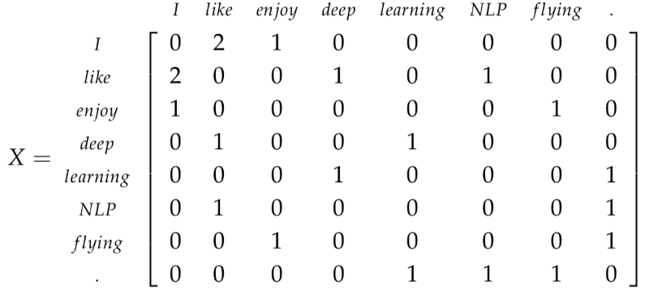
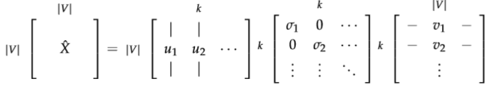
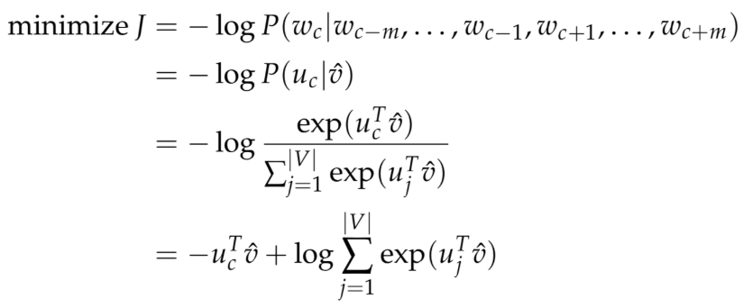
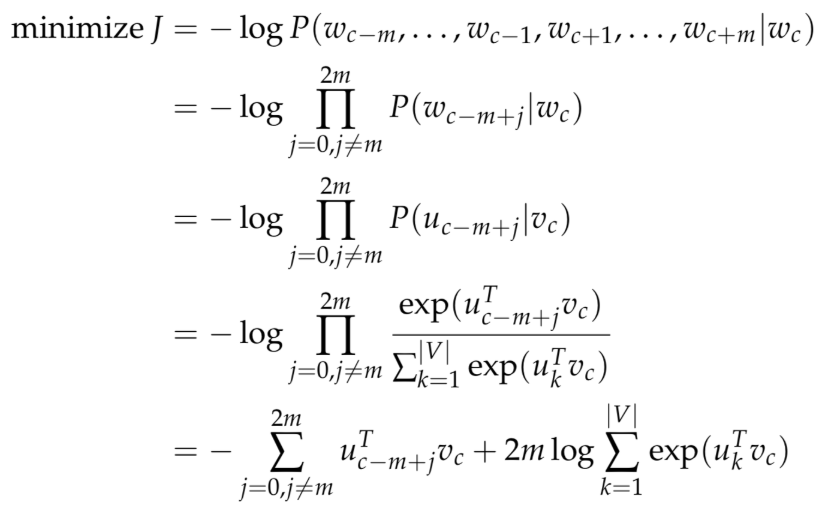
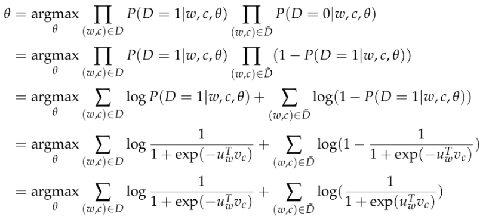
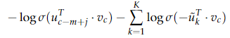
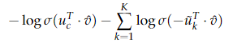
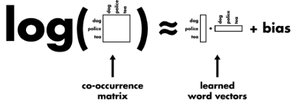

[TOC]

# 文本表示

​	计算机不方便直接对文本字符串进行处理，因此需要进行数值化或者向量化。良好的文本表示形式可以极大的提升机器学习算法效果。


## 1.表示方法

* 离散表示
   * one-hot表示
   * multi-hot表示
* 分布式表示
   * 基于矩阵
     * 基于降维的方法
     * 基于聚类的方法
   * 基于神经网络
     * CBOW
     * Skip-gram
     * NNLM
     * C&W


## 2.文本离散表示

### bag of words

​	将字符串视为一个 **“装满字符（词）的袋子”** ，袋子里的 **词语是随便摆放的**。

​	[1,0,1,1,1,0,0,1,…] -- 向量的**每个维度唯一对应着词表中的一个词**。可见这个向量的大部分位置是0值，这种情况叫作**“稀疏”**。为了减少存储空间，我们也可以只储存非零值的位置。

#### 优缺点

优点：

1. 简单，方便，快速
2. 在语料充足的前提下，对于简单的自然语言处理任务效果不错。如文本分类。

缺点：

1. 其准确率往往比较低。凡是出现在文本中的词一视同仁，不能体现不同词在一句话中的不同的重要性。
2. **无法关注词语之间的顺序关系，这是词袋子模型最大的缺点**。如“武松打老虎”跟“老虎打武松”在词袋子模型中是认为一样的。


### TF-IDF

​	词频——TF（term frequency）

​	统计逆文档频率——IDF：基本假设是**如果一个词语在不同的文档中反复出现，那么它对于识别该文本并不重要**。

​										$$-log({出现该词语的文档占总文档出现的频率})$$


## 3.文本分布式表示

​	one-hot vector：假设我们的词库总共有n个词，那我们开一个1*n的高维向量。

​					$$ w^{aardcark}=
\begin{bmatrix}
​     1  \\
​     0  \\
​     0 \\
​     \vdots \\
​     0
\end{bmatrix} ,
w^{a}=
\begin{bmatrix}
​     0  \\
​     1  \\
​     0 \\
​     \vdots \\
​     0
\end{bmatrix}$$

​	向量没办法给我们任何形式的词组相似性权衡。例如:

​							$$(w^{hotel})^Tw^{motel}=0$$

​	一个极高维度的空间，然后每个词语都会占据一个维度，因此没有办法在空间中关联起来。


### 基于SVD降维的表示方法

​	建立一个词组文档矩阵$X$，具体是这么做的：遍历海量的文件，每次词组i出现在文件j中时，将$X_{ij}$的值加1。这会是个很大的矩阵$R^{|V| ×M}$，而且矩阵大小还和文档个数M有关系。

#### 	基于窗口的共现矩阵X

​	规定一个固定大小的滑动窗口，然后统计每个中心词所在窗口中相邻词的词频。

> 1. I enjoy flying.
> 2. I like NLP.
> 3. I like deep learning.
>
> 有：
>
> 

​	对X做奇异值分解，只保留前k个维度：

​	把子矩阵$U_{1:|V|,1:k}$视作我们的词嵌入矩阵。也就是说，对于词表中的每一个词，我们都用一个k维的向量来表达了。



​	问题在于：

> * 矩阵的维度会经常变化（新的词语经常会增加，语料库的大小也会随时变化）。
> * 矩阵是非常稀疏的，因为大多数词并不同时出现。
> * 矩阵的维度通常非常高（$≈10^6×10^6$）
> * 训练需要$O(n^2)$的复杂度（比如SVD）
> * 需要专门对矩阵X进行特殊处理，以应对词组频率的极度不平衡的状况

​	有一些办法可以缓解一下上述提到的问题：

> * 忽视诸如“he”、“the” 、“has”等功能词。
> * 应用“倾斜窗口”（ramp window），即:根据文件中词组之间的距离给它们的共现次数增加相应的权重。
> * 使用皮尔森的相关性（Pearson correlation），将0记为负数，而不是它原来的数值。


### 基于神经网络的表示方法

> ​	如果数据量不足，不要从零开始训练自己的词向量

#### 连续词袋模型（CBOW）

以上下文，预测中心词。

* $w_i$:单词表V中的第i个单词，i维是1其他维是0的one-hot向量
* $v\in R^{n*|V|}$：输入词矩阵
* $v_i$：V的第i列，单词$w_i$的输入向量
* $u\in R^{|V|*n}$：输出词矩阵
* $u_i$：U的第i行，单词$w_i$的输出向量
* $n$：“嵌入空间”（embedding space）的维度

整个过程:

1.	对于m个词长度的窗口，one-hot向量（$x^{(c-m)},\cdots,x^{(c-1)},x^{(c+1)},\cdots,x^{(c+m)}$）。
2.	上下文的嵌入词向量（$v_{c-m+1}=Vx^{(c-m+1)},\cdots, v_{c+m}=Vx^{(c+m)}$ ）
3.	将这些向量取平均$\hat v={v_{c-m}+v_{c-m+1}+\cdots+v_{c+m}\over2m}$
4.	产生一个logits向量 $z=U\hat v$
5.	将得分向量转换成概率分布形式$\hat y=softmax(z)$
6.	$y$是 $x^{c}$ 的one-hot向量。计算损失$$H(\hat y,y)=-\sum_{j=1}^{|V|}y_jlog(\hat y_j)$$

y只是一个one-hot向量，于是上面的损失函数就可以简化为：

​		$$H(\hat y,y)=-y_ilog(\hat y_i)$$

最终的优化目标为：



用梯度下降法去更新每一个相关的词向量𝑢𝑐和𝑣𝑗


#### Skip-Gram

以中心词预测上下文。

* $w_i$:单词表V中的第i个单词，i维是1其他维是0的one-hot向量
* $v\in R^{n*|V|}$：输入词矩阵
* $v_i$：V的第i列，单词$w_i$的输入向量
* $u\in R^{|V|*n}$：输出词矩阵
* $u_i$：U的第i行，单词$w_i$的输出向量
* $n$：“嵌入空间”（embedding space）的维度

整个过程:

1.	生成one-hot输入向量x。
2.	得到上下文的嵌入词向量$v_c=Vx$。
3.	不需要取平均值的操作，所以直接是$v_c$。
4.	通过$u=Uv_c$产生2m个logits向量$u_{c-m},\cdots,u_{c-1},u_{c+1},\cdots,u_{(c+m)}$。
5.	将logits向量转换成概率分布形式$y=softmax(u)$。
6.	产生的概率分布与真实概率分布$y^{c-m},\cdots,y^{c-1},,y^{c+1}\cdots,y^{c+m}$计算交叉熵损失。

最终的优化目标为：



不同的地方是我们这里需要引入朴素贝叶斯假设来将联合概率拆分成独立概率相乘。


#### 负例采样（Negative Sampling）

​	对整个单词表|V|求和的计算量是非常巨大的，任何一个对目标函数的更新和求值操作都会有O(|V|)的时间复杂度。我们需要一个思路去简化一下，我们想办法去求它的近似。

​	Mikolov ET AL.在他的《Distributed Representations of Words and Phrases and their Compositionality》中提出了负例采样。

​	考虑一个“词-上下文”对（w,c），令P(D = 1|w, c)为(w, c)来自于语料库的概率。相应的，P(D = 0|w, c) 则是不来自于语料库的概率。对P(D = 1|w, c)用sigmoid函数建模：

​				$$p(D=1|w,c,\theta)= {1\over{1+e^{(-v_c^Tv_w)}}}$$

​	建立一个新的目标函数。如果(w, c)真是来自于语料库，目标函数能够最大化P(D = 1|w, c)。



​		$\tilde D$表示不来自于语料库的数据。


​	在skip gram中，对于$c - m + j$位置的context 和 center word 的目标函数为：（所有上下文还要求和）



​	K -- 为负例样本的个数。

​	这样将 $|V|$ words中的softmax，变成了 K个负例中进行 sigmoid ，减少了计算量。多分类目标变为二分类目标。

​	在CBOW中为：



​	负例采样在word的词频分布的3/4次方上进行采样。使得分布更平滑。


#### Hierarchical Softmax

​	对CBOW或者Skip gram的最后一层损失求解方式改进。目标不是目标单词的one hot编码，而是在所有单词预先构建好的Huffam tree中的huffman编码。

​	损失函数由Huffam tree中每个node的sigmoid函数预测结果和实际的huffman编码之间计算求得。

​	Huffman tree保证了任何一个单词的编码不会是另一个单词的前缀。

> ​	构建流程：
>
> 1. 根据所有单词的词频构建最小堆。
> 2. 取出前两个最小单词（left child and right child），将二者词频之和插入最小堆。
> 3. 二者词频之和作为left child and right child的父节点，构建tree。
> 4. 重复以上步骤，直到min heap中只有一个node，作为tree的root。

​	huffman编码：从root到leaf node的路径，走left child编码加入0，走right child编码加入1。最终编码为该leaf node对应的编码。

​	越常用的词（词频越高的词）拥有更短的编码。

​	word2vec中正好采用了相反的编码规则，规定沿着左子树走，那么就是负类(哈夫曼树编码1)，沿着右子树走，那么就是正类(哈夫曼树编码0)。

​	每个tree node处：

​					$$p(+)= {1\over{1+e^{(-v_w^T\theta)}}}$$

​	每个tree node都有参数$\theta$，输入只是模型前面部分输出的向量$v_w$


#### Glove

​	加入了global statistics，用某个大小window中两个单词的共现次数$X_{ij}$表示。

- 目标函数由cross entropy变为least square。
- 用$log(X_{ij})$作为“normalization cost”。（$X_{ij}$ : number of times word j occur in the context of word i）
- $v_i$和$u_j$相乘，不需要用指数函数。(推导结果)
- 加入weighted function $f(X_{ij})$


损失函数：
$$
J=\sum_{i=1}^{V} \sum_{j=1}^{V} f\left(X_{i j}\right)\left(w_{i}^{T} w_{j}+b_{i}+b_{j}-\log X_{i j}\right)^{2}
$$
> $X_{ij}$      --$i\ \textrm{and}\ j$在某个窗口大小中的共现频率  
> $f(X_{ij})$--权重系数，共现越多的 pair 对于目标函数贡献应该越大，但是又不能无限制增大，所以对共现频率过于大的 pair 限定最大值，以防训练的时候被这些频率过大的 pair 主导了整个目标函数。  
> b        --两个偏置项  
> $w_{i}$      --当前词的向量， 
> $w_{j}$      --对应的是与其在同一个窗口中出现的共现词的词向量，两者的向量点乘要去尽量拟合它们共现频率的对数值

​	如果两个词共现频率越高，那么其对数值当然也越高，因而算法要求二者词向量的点乘也越大。

​	而两个词向量的点乘越大，其实包含了两层含义：

> - 第一，要求各自词向量的模越大，通常来说，除去频率非常高的词（比如停用词），对于有明确语义的词来说，它们的**词向量模长会随着词频增大而增大**，因此两个词共现频率越大，要求各自词向量模长越大是有直觉意义的
> - 第二，要求这两个词向量的夹角越小，这也是符合直觉的，因为**出现在同一个语境下频率越大，说明这两个词的语义越接近，因而词向量的夹角也偏向于越小**。




#### fastText

​	word2vec 和 GloVe 都不需要人工标记的监督数据，只需要语言内部存在的监督信号即可以完成训练。而与此相对应的，**fastText 则是利用带有监督标记的文本分类数据完成训练。**

​	类似CBOW，但不同点在于：

1. 在输入数据上，CBOW 输入的是一段区间中除去目标词之外的所有其他词的向量加和或平均，而 **fastText 为了利用更多的语序信息**，将 bag-of-words 变成了 bag-of-features，也就是输入 x 不再仅仅是一个词，还可以**加上字符级别的 bigram 或者是 trigram 的信息**等等。
2. 第二个不同在于，CBOW 预测目标是语境中的一个词，而 **fastText 预测目标是当前这段输入文本的类别**，正因为需要这个文本类别，因此才说 fastText 是一个监督模型。

​    fastText 的网络结构和 CBOW 基本一致，同时在输出层的分类上也使用了 Hierachical Softmax 技巧来加速训练。

​	目标函数：
$$
-\frac{1}{N} \sum_{n=1}^{N} y_{n} \log f\left(B A x_{n}\right), x_{n}=\sum_{i=1}^{l_{n}} x_{n, i}
$$

> $x_{n, i}$  --语料当中第 n 篇文档的第 i 个词以及加上 N-gram 的特征信息  
> A      --最终可以获取的词向量信息


### 词向量的作用与获取

​	高阶的深度学习自然语言处理任务，都可以用词向量作为基础。可以从[开源链接](https://github.com/Embedding/Chinese-Word-Vectors)获取。

#### 词向量的意义

* 基于词与其他词的某种共现关系
   * skip-gram with negative-sampling 与 PMI矩阵 的等价性证明《Neural-Word-Embeddings-as-Implicit-Matrix-Factorization》
     * 神经网络与SVD的求解方法只是降维方式的不同
     * 神经网络更像MF，而MF与SVD的降维的约束条件不同，神经网络的目标函数与MF的目标函数也不同
   * GloVe与MF关系更近
     * 目标函数更像
     * CBOW没有类似的降维矩阵对应
* 基于语言模型
   * 词向量与语言模型本来是两个独立的NLP问题领域，因为深度学习联系在了一起。
   * 基于词向量构建成句子向量进而进而完成语言模型的任务
* 基于其他监督学习任务
   * 词向量并不只是语言模型可以得到，基于有监督学习也可以得到：C&W[了解](http://licstar.net/archives/328#s22)
   * 基于词向量构建成句子向量进而完成文本分类或文本相似度判断的任务


------


## 4.关键词提取

### TF-IDF文本关键词抽取方法

（1） 对于给定的文本D进行分词、词性标注和去除停用词等数据预处理操作。得到n个候选关键词，即D=[t1,t2,…,tn] ；

（2） 计算词语ti 在文本D中的词频；

（3） 计算词语ti 在整个语料的IDF=log (Dn /(Dt +1))，Dt 为语料库中词语ti 出现的文档个数；

（4） 计算得到词语ti 的TF-IDF=TF*IDF，并重复（2）—（4）得到所有候选关键词的TF-IDF数值；

（5） 对候选关键词计算结果进行倒序排列，得到排名前TopN个词汇作为文本关键词。


### 基于TextRank的文本关键词抽取方法

（1） 对于给定的文本D进行分词、词性标注和去除停用词等数据预处理操作。得到n个候选关键词，即D=[t1,t2,…,tn] ；

（2） 构建候选关键词图G=(V,E)，其中V为节点集，由候选关键词组成，并采用共现关系构造任两点之间的边，两个节点之间仅当它们对应的词汇在长度为K的窗口中共现则存在边，K表示窗口大小即最多共现K个词汇；

（3） 根据公式迭代计算各节点的权重，直至收敛；(见中文文本处理部分)

（4） 对节点权重进行倒序排列，得到排名前TopN个词汇作为文本关键词。


### 基于Word2Vec词聚类的文本关键词抽取方法

（1） 对Wiki中文语料进行Word2vec模型训练，[代码](./code/gensim-word2vec.html)

（2） 对于给定的文本D进行分词、词性标注和去除停用词等数据预处理操作。得到n个候选关键词，即D=[t1,t2,…,tn] ；

（3） 遍历候选关键词，从词向量文件中抽取候选关键词的词向量表示，即WV=[v1，v2，…，vm]；

（4） 对候选关键词进行K-Means聚类，得到各个类别的聚类中心；

（5） 计算各类别下，组内词语与聚类中心的距离（欧几里得距离），按聚类大小进行升序排序；

（6） 对候选关键词计算结果得到排名前TopN个词汇作为文本关键词。

步骤（4）中需要人为给定聚类的个数，具体参考文档主题的个数。

```python
from sklearn.cluster import KMeans
from sklearn.decomposition import PCA


def getkeywords_kmeans(data,topK):
    words = data["word"] # 词汇
    vecs = data.ix[:,1:] # 向量表示

    kmeans = KMeans(n_clusters=1,random_state=10).fit(vecs)
    labels = kmeans.labels_ #类别结果标签
    labels = pd.DataFrame(labels,columns=['label'])
    new_df = pd.concat([labels,vecs],axis=1)
    vec_center = kmeans.cluster_centers_ #聚类中心
    
    # 计算距离（相似性） 采用欧几里得距离（欧式距离）
    distances = []
    vec_words = np.array(vecs) # 候选关键词向量，dataFrame转array
    vec_center = vec_center[0] # 第一个类别聚类中心,本例只有一个类别
    length = len(vec_center) # 向量维度
    for index in range(len(vec_words)): # 候选关键词个数
        cur_wordvec = vec_words[index] # 当前词语的词向量
        dis = 0 # 向量距离
        for index2 in range(length):
            dis += (vec_center[index2]-cur_wordvec[index2])*(vec_center[index2]-cur_wordvec[index2])
        dis = math.sqrt(dis)
        distances.append(dis)
    distances = pd.DataFrame(distances,columns=['dis'])

    result = pd.concat([words, labels ,distances], axis=1) # 拼接词语与其对应中心点的距离
    result = result.sort_values(by="dis",ascending = True) # 按照距离大小进行升序排序
```

可使用PCA降维，但具体视效果而定。