[TOC]

# 文本表示进阶

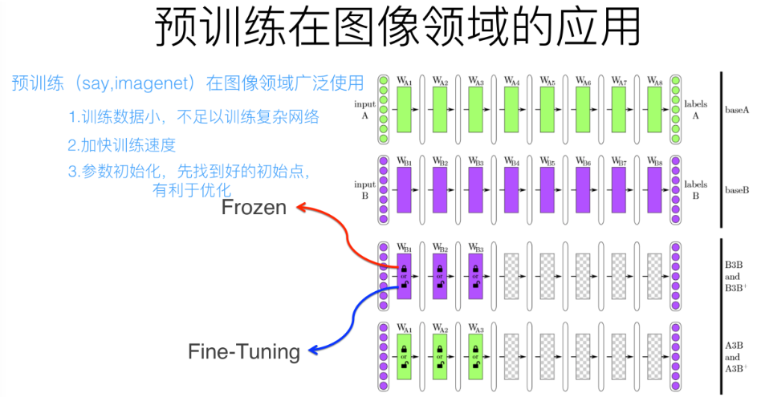

​	预训练过程是做图像或者视频领域的一种比较常规的做法，这种做法很有效，能明显促进应用的效果。	

​	两种做法，一种是浅层加载的参数在训练C任务过程中不动，这种方法被称为“Frozen”;另外一种是底层网络参数尽管被初始化了，在C任务训练过程中仍然随着训练的进程不断改变，这种一般叫“Fine-Tuning”。

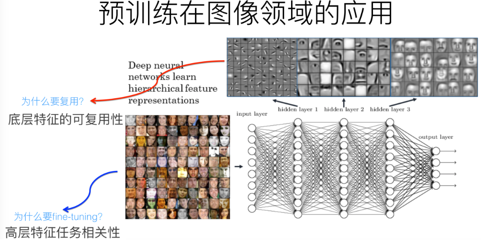

​	用ImageNet来做网络的预训练，主要有两点，一方面ImageNet是图像领域里有很多事先标注好训练数据的数据集合，是个很大的优势，量越大训练出的参数越靠谱；另外一方面因为ImageNet有1000类，类别多，所以通用性好。

​	NLP相对图像的特点在于，词作为NLP的基本要素，比像素的抽象程度更高，已经加入了人类数万年进化而来的抽象经验。 

​	预训练语言模型的优势在于：

1. 近乎无限量的优质数据
2. 无需人工标注
3. 一次学习多次复用
4. 学习到的表征可在多个任务中进行快速迁移

​	**word2vec的问题**：Word Embedding本质上是个静态的。不论新句子上下文单词是什么，这个单词的Word Embedding不会跟着上下文场景的变化而改变。这就是问题所在，多义性的消失。

## ELMo：Embedding from Language Models

​	ELMo采用了典型的两阶段过程，

- 第一个阶段是利用语言模型进行预训练；
- 第二个阶段是在做下游任务时，从预训练网络中提取对应单词的网络各层的Word Embedding作为新特征补充到下游任务中。

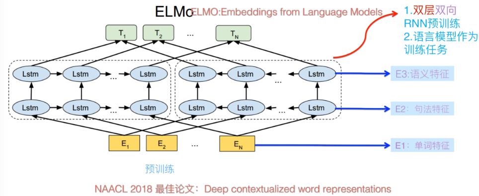

### 结构	

​	ELMo 为了利用无标记数据，使用了语言模型：

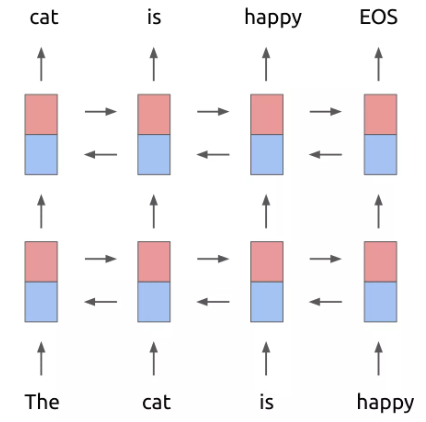

​	基本框架是一个双层的 Bi-LSTM，不过在第一层和第二层之间加入了一个残差结构（一般来说，残差结构能让训练过程更稳定）。做预训练的时候，ELMo 的训练目标函数为:
$$
\sum_{k=1}^{N} \log p\left(t_{k} | t_{1}, \ldots, t_{k-1}\right)+\log p\left(t_{k} | t_{k+1}, \ldots, t_{N}\right)
$$

​	Bi-LSTM，一组正向，一组反向。$t_k$之前的单词序列Context-before称为上文，之后的单词序列Context-after称为下文。

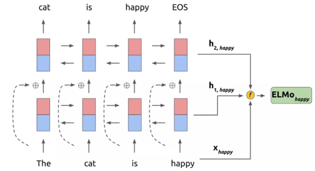

### 输入层和输出层改进

​	ELMo 借鉴了 2016 年 Google Brain 的 Rafal Jozefowicz 等人发表的 Exploring the Limits of Language Modeling。输入层和输出层不再是 word，而是变为了一个 **char-based CNN 结构**。

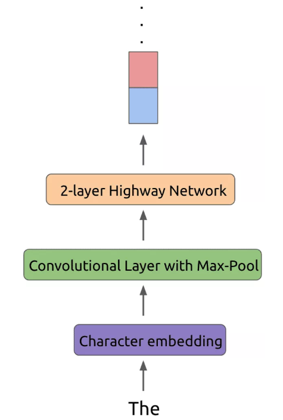

#### 输出层：

​	将CBOW中的普通softmax:
$$
P\left(w_{t} | c_{t}\right)=\frac{\exp \left(e^{\prime}\left(w_{t}\right)^{T} x\right)}{\sum_{i=1}^{|V|} \exp \left(e^{\prime}\left(w_{i}\right)^{T} x\right)}, x=\sum_{i \in c} e\left(w_{i}\right)
$$
​	转换为：
$$
p\left(t_{k} | t_{1}, \ldots, t_{k-1}\right)=\frac{\exp \left(C N N\left(t_{k}\right)^{T} h\right)}{\sum_{i=1}^{|V|} \exp \left(C N N\left(t_{i}\right)^{T} h\right)}, h=L S T M\left(t_{k} | t_{1}, \ldots, t_{k-1}\right)
$$
​	char-based CNN 模型是现成已有的，对于任意一个目标词都可以得到一个向量表示 CNN($t_k$) 。利用 CNN 解决有三点优势:

>   1. CNN 能减少做 Softmax 时全连接层中的必须要有的 |V|* h 的参数规模，只需保持 CNN 内部的参数大小即可。 (PS: 卷积核参数共享)
>   2. CNN 可以解决 OOV （Out-of-Vocabulary）问题，这个在翻译问题中尤其头疼
>   3. 在预测阶段，CNN 对于每一个词向量的计算可以预先做好，更能够减轻 inference 阶段的计算压力。

#### 输入层：

​	相似结构，不同输出。训练时间会略微增加，因为原来的 look-up 操作可以做到更快一些。

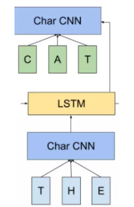

​	句子中每个单词都能得到对应的三个Embedding:

​	最底层是单词的Word Embedding，往上走是第一层双向LSTM中对应单词位置的Embedding，这层编码单词的句法信息更多一些；再往上走是第二层LSTM中对应单词位置的Embedding，这层编码单词的语义信息更多一些。

#### 结果：

​	有三层的词向量可以利用：

- 输入层 CNN 的输出，即是 LSTM 的输入向量，
- 第一层 LSTM 的hidden state：这层编码单词的句法信息更多一些
- 第二层的hidden state：这层编码单词的语义信息更多一些

   LSTM 是双向的，因此对于任意一个词，如果 LSTM 的层数为 L 的话，总共可获得的向量个数为 2L+1。

​	对于每一个词，可以根据下面的式子得到它的向量，其中 γ 是一个 scale 因子，加入这个因子主要是想将 ELMo 的向量与具体任务的向量分布拉平到同一个分布水平：
$$
\mathbf{E} \mathbf{L} \mathbf{M} \mathbf{o} k^{t a s k}=\gamma^{t a s k} \sum j= s_{j}^{t a s k} \mathbf{h}_{k, j}
$$

> $\mathbf{h}_{k, j}$便是针对每一层的输出向量，利用一个 softmax 的参数来学习不同层的权值参数$s_{j}^{t a s k}$，因为不同任务需要的词语意义粒度也不一致，一般认为浅层的表征比较倾向于句法，而高层输出的向量比较倾向于语义信息。
>
> 因此通过一个 softmax 的结构让任务自动去学习各层之间的权重。

### 计算复杂度

​	**基于传统统计的 N-gram 还是普通神经网络的 NNLM 结构**，都会有一个很严重的问题，那就是计算复杂度随着上下文窗口 N 大小的增大急剧上升。 N-gram 是指数上升；NNLM 是以 |d| × N 的形式增加。

​	**CBOW 和 Skip-gram 以及再后来的 GloVe** 终于做到了计算复杂度与所选窗口大小无关，**BUT**只是预测单个词的计算时间复杂度，如果是求整个输入序列的话，还是避免不了要与序列长度相关。

> ​	这几种方法（N-gram, ..., GloVe），它们都受限于所使用的模型表征能力，**某种意义上都只能得到比较偏上下文共现意义上的词向量，并且也很少考虑过词序对于词的意义的影响**。

​	

​	RNN 结构的计算复杂度：

 1. 纵向上主要是 RNN 结构本身的时间复杂度

    1. RNN 结构内部的 hidden state 维度
    1. 模型结构的复杂度
    1. 在 ELMo 中的话还跟词典大小相关（因为最后一层还是一个词典大小上的分类问题，以及输入也需要维护一个词典大小的 loop up 操作）  

    但是在机器性能提升的情况下，这一部分至少不是阻碍词向量技术发展的最关键的因素了

  2. 横向上的计算复杂度，就主要是受制于输入序列的长度

     1. RNN 结构本身因为在时间序列上共享参数，其自身计算复杂度这一部分不变
     1. 输入序列长度

## 从词向量到句子向量

- 无监督句子表示：将句子表示成定长向量
- 基线模型：word2vec
- 模型：AE(Auto Encoder)，LM(language model)，Skip-Thoughts等
  - 本身的信息
  - 上下文的信息
  - 任务的信息

### PV-DM 和 PV-DBOW

​	PV-DM 的全称是 Distributed Memory Model of Paragraph Vectors：

​		类似CBOW，输入=>>文档向量+上下文向量；输出=>>下一个词向量。有新文档需要再走一遍训练流程

​	PV-DBOW 的全称则是 Distributed Bag of Words version of Paragraph Vector

​		和 Skip-gram 类似，通过文档来预测文档内的词，训练的时候，随机采样一些文本片段，然后再从这个片段中采样一个词，让 PV-DBOW 模型来预测这个词。

> From Mikolov et al. experiment, **PV-DM is consistently better than PV-DBOW**.
>
> **Concatenation way is often better** than sum/ average.

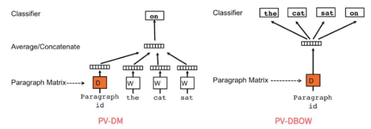

​	问题：很难去表征词语之间的更丰富的语义结构

### Skip-thoughts

​	Skip-thoughts 直接在句子间进行预测，也就是将 Skip-gram 中以词为基本单位，替换成了以句子为基本单位   

​	具体做法就是选定一个窗口，遍历其中的句子，然后分别利用当前句子去预测和输出它的上一句和下一句

> 对于句子的建模利用的 RNN 的 sequence 结构，预测上一个和下一个句子时候，也是利用的一个 sequence 的 RNN 来生成句子中的每一个词，所以这个结构本质上就是一个 Encoder-Decoder 框架，只不过和普通框架不一样的是，Skip-thoughts 有两个 Decoder。

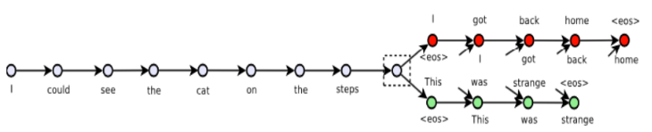

### Quick-thoughts

​	解决Skip-thoughts中RNN训练太慢的问题  

​	把 Skip-thoughts 的生成任务改进成为了一个**分类任务**，具体说来就是把同一个上下文窗口中的句子对标记为正例，把不是出现在同一个上下文窗口中的句子对标记为负例，并将这些句子对输入模型，让模型判断这些句子对是否是同一个上下文窗口中，很明显，这是一个分类任务。

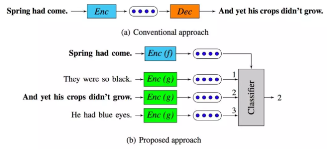

### InferSent

​	思想特别简单，先设计一个模型在斯坦福的 SNLI（Stanford Natural Language Inference）数据集上训练，而后将训练好的模型当做特征提取器，以此来获得一个句子的向量表示，再将这个句子的表示应用在新的分类任务上，来评估句子向量的优劣。

​	进行多任务学习，不同任务使得模型学习到不同特征的提取能力。

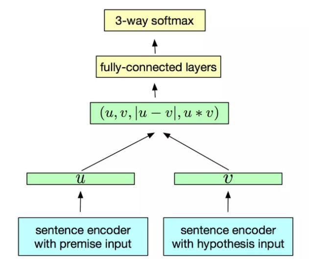

### General Purpose Sentence Representation

​	有很多相似的研究：

​	Learning General Purpose Distributed Sentence Representations via Large Scale Multi-task Learning，就提出了利用四种不同的监督任务来联合学习句子的表征，这四种任务分别是：Natural Language Inference，Skip-thougts，Neural Machine Translation 以及 Constituency Parsing 等

​	训练结束后，将**模型的输出作为句子的表征**（或者把这个联合学习的模型作为特征提取器），然后直接在这个表征上接上非常简单的全连接层做分类器，并且同时**保证最底层的特征提取器中参数不动**（也就是只把它当做特征提取器），再在新的分类任务上做训练（只训练最后接上的全连接层分类器），最后根据训练出来的简单分类器在各自分类任务的测试集上做评估。

### Universal Sentence Encoder

​	思路类似General Purpose Sentence Representation，只不过作者提出了利用 Transformer 和 DAN（上文提到过的和 CBOW 相似， ***Deep Unordered Composition Rivals Syntactic Methods for Text Classification\***）两种框架作为句子的 Encoder。

> - Transformer 结构更为复杂，参数更多，训练也相对比较耗时，但是一般来说效果会更好一些。
> - DAN 结构简单，只有两个隐藏层（甚至可以减小为只需要一个隐藏层），参数比较少，训练相对比较省时省资源，但是一般来说效果会差一些（并不是绝对，论文中也发现某些场景下 DAN 的效果甚至更好）。

​	作者既在无标记数据上训练，也在监督数据上训练，最后在十个分类任务上进行迁移学习的评估。

​	作者还放出了他们预训练好的 Encoder，可以供迁移学习的句子特征提取器使用。

> 预训练 Encoder：https://tfhub.dev/google/universal-sentence-encoder/2

## ULMFit

​	**Universal Language Model Fine-tuning for Text Classification** 中，提出了ULMFit 结构，其实这本质上是他们提出的一个方法，而不是具体的某种结构或模型。主要应用于文本分类问题中。

​	ULMFiT 最终在分类任务上表现惊艳，尤其是只需要 100 个标记数据，就能够学习到一个表现非常 comparable 的分类器。

​	和ELMo基本思路类似，也是预训练完成后在具体任务上进行 finetune，但不同之处也有很多。

​	分为三个阶段：

> - 大规模预训练
> - 任务数据预训练
> - 接任务模型部分再次finetune

​	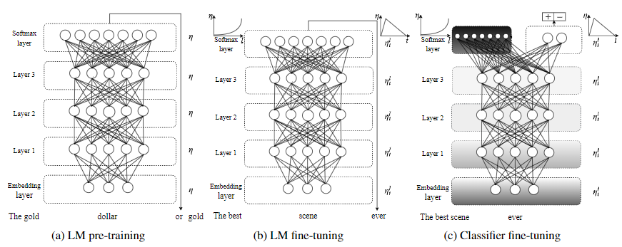

### AWD-LSTM

​	Averaged SGD 是指先将模型训练到一定 epoch，然后再将其后的每一轮权值进行平均后，得到最终的权值。
$$
w_{k+1}=w_{k}-\gamma_{k} \nabla f\left(w_{k}\right)
$$
变成
$$
w=\frac{1}{K-T+1} \sum_{i=T}^{K} w_{i}
$$

> ​	 T 是一个阈值，而 K 是总共的迭代次数，这个式子的意思就是**把迭代到第 T 次之后，对该参数在其后的第 T 轮到最后一轮之间的所有值求平均，从而得到最后模型的该参数值**。

### DropConnect 

​	LSTM 上一个时刻和下一个时刻之间的隐藏层之间是有连接的，并且这个连接通过一个全连接的矩阵相连，而这个模型则用了 DropConnect 的方法随机 drop 掉一些连接，从而减少了一些过拟合的风险，当然在输入层到隐藏层之间也有正常的 dropout 操作。

### 微调的技巧(两次 finetune)

#### 	 1. discriminative fine-tune

​	不同层在训练更新参数的时候，赋予不同的学习率。

​	不同层的表征有不同的物理含义，比如浅层偏句法信息，高层偏语义信息，因此对于不同层的学习率不同。
$$
\theta_{t}^{l}=\theta_{t-1}^{l}+\eta^{l} \nabla_{\theta^{l}} J(\theta)
$$

$$
\eta^{l-1}=\frac{\eta^{l}}{2.6}
$$

#### 2. slanted triangular learning rates

> 1. 在 finetune 的第一阶段，希望能够先稳定住原来已经在大规模语料集上预训练好的参数， 选择比较小的 finetune 学习率
> 2. 后逐步加大学习率，使得学习过程能够尽量快速。
> 3. 当训练接近尾声时，逐步减小学习率，这样让模型逐渐平稳收敛。
>
> 计算：
>
> 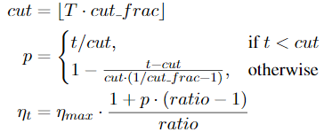
>
> T -- the  number  of  training  iterations；
> cut_frac -- the fraction of iterations we increase lr；
> cut -- the iteration when we switch fromincreasing to decreasing the lr;
> p -- the fraction ofthe number of iterations we have increased or willdecrease the LR respectively;
> ratio -- specifies how much smaller the lowest lr is from the maximum lr $η_{max}$
>
> 一般取：cut_frac= 0.1, ratio= 32 and $η_{max}$= 0.01

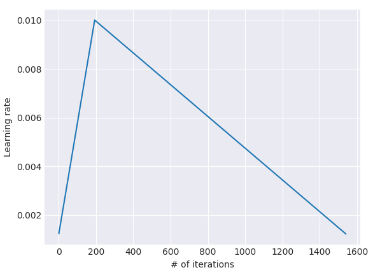

### gradual unfreezing

​	预训练模型在新任务上 finetune 时，**逐层解冻模型**，先 finetune 最后一层，然后再解冻倒数第二层，把倒数第二层和最后一层一起 finetune，然后再解冻第三层。以此类推，逐层往浅层推进，最终 finetune 整个模型或者终止到某个中间层。这样做的目的也是为了 finetune 过程能够更平稳。

## Transformer

​	因为 Self-attention 的存在，才使得 Transformer 在做类似翻译问题的时候，可以让其 Encoder 不用做序列输入，而是将整个序列一次全输入，并且超长序列的输入也变得可能。而具体到 Self-attention 中，可以用下图表示。[优质Blog](https://jalammar.github.io/illustrated-transformer/)

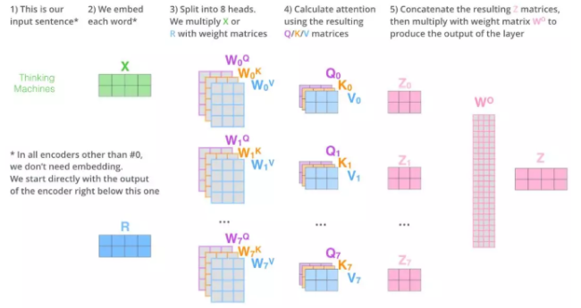

​	Self-attention 中的**多头机制**便是将这样的操作分别进行多次，让句子的表征充分学习到不同的侧重点，最终将这些多头学习出来的表征 concat 到一起，然后再同一个全连接网络，便可以得到这个句子最终 Self-attention 下新的表示。

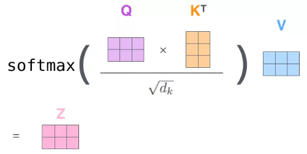

> ​	训练时： Decoder 中的输入可以用矩阵形式一次完成当前整个序列的 decode 过程，因为 ground truth 已经提前知道，只需做好每个词的 mask 就好
>
> ​	inference 的时候：Decoder 必须按照序列输入，因为在生成每一个词的时候，必须先生成它的前一个词，无法一次将整个序列全部生成

Decoder 的 attention 实际包含两部分：

1. 第一部分是带有 mask 的 Self-attention，通过 mask 将 decode 阶段的 attention 限定只会 attention 到已经生成过的词上，因此叫做 Mask Self-attention。
2. 第二部分是普通的 Self-attention 操作，不过这时的 K 和 V 矩阵已经替换为 Encoder 的输出结果，所以本质上并非一个 Self-attention。

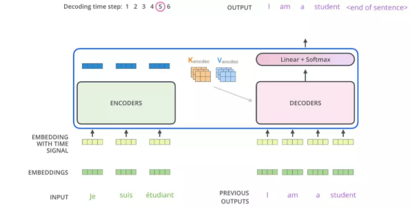

​	结构展示：

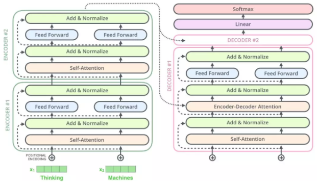

​	[编码实现](./2.0-Transformer.html)

## GPT

​	GPT 使用的 Transformer 是只用了 Decoder，因为对于语言模型来讲，确实不需要 Encoder 的存在。

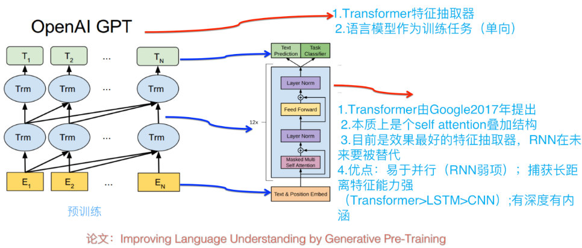

​	要做超长的序列输入（可以长达 11000 个词），为了能够高效节省时间和内存的处理如此长的序列，做了一些 Memory-Compressed 工作，主要是两方面：

> 1. 通过 CNN 操作，把 K 和 V 压缩到序列长度更小的一个矩阵，同时保持 Q 不变，这样也能在相当程度上减少计算量
> 1. 把一个 batch 内部的序列按长度进行分组，然后分别在每个组内部进行 self-attention 操作，避免将一些很短的句子也 padding 到整个语料的最大长度；

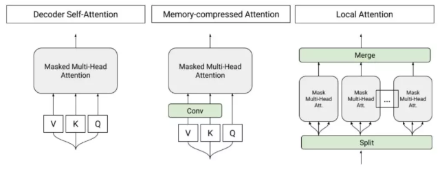

​	利用语言模型的目标函数预训练完成后，便可以在具体任务上进行 finetune，和 ULMFiT 中的 finetune 分为两个阶段的方法不一样的是，GPT 直接把这两个过程糅合到一个目标函数中：
$$
L_{3}(C)=L_{2}(C)+\lambda L_{1}(C)
$$
​	其中 L2 是 task-specific 的目标函数， L1 则是语言模型的目标函数。论文中说这种联合学习方式能够让训练效果更好。

改造任务类型：

- 分类问题：直接在原序列的开始和末尾添加表示开始和末尾的符号，
- Text Entailment 问题：将 Premise 和 Hypothesis 通过一个中间分隔符“$”连接起来成为一个序列，然后同样在开头和末尾添加标记符号。
- 文本相似问题：因为序列 1 和序列 2 没有先后关系，因此将先后关系相反的两个序列作为输入。
- Question Aswering ：将 query 和每个候选的 answer 都分别连接成一个序列作为输入，最后按各自的打分进行排序。

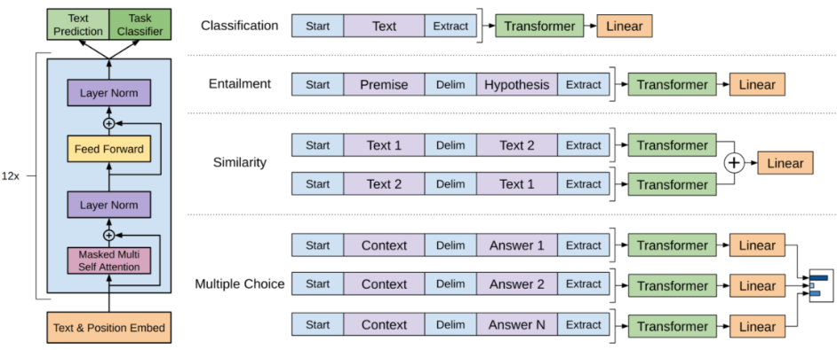

​	对输入数据结构进行一定处理。

## BERT

​	Bidirectional Encoder Representation from Transformers，进一步完善和扩展了 GPT 中设计的通用任务框架，使得 BERT 能够支持包括：句子对分类任务、单句子分类任务、阅读理解任务和序列标注任务。

### 模型特点

#### 1. 利用了真双向的 Transformer

* Encoder 中用了 Self-attention 机制，而这个机制会将每一个词在整个输入序列中进行加权求和得到新的表征  
* 更多的 transformer 的 block（意味着经过更多 Self-attention），那么互相交融的程度将会更高（Base 模型是 12层，Large 模型是 24层）  
* Large 版本 BERT 的多头机制中 Head 个数多达 16 个，多种关系的学习

* ELMo 与 GPT 本质上还是一个单向的模型，ELMo 稍微好一点，将两个单向模型的信息 concat起 来。GPT 则只用了单向模型， Decdoer 的天生基因决定的。显然句子中有的单词的语义会同时依赖于它左右两侧的某些词，仅仅从单方向做encoding是不能描述清楚的。

#### 2. Mask-LM (Mask-Language Model)

​	将单向预测的LM改变为双向的LM，预测目标变为什么？

​	为了利用双向信息，改进了普通语言模型成为完形填空式的 Mask-LM (Mask-Language Model)，随机选取15%的词进行Mask，然后预测。

> - 输入序列依然和普通Transformer保持一致，只不过把挖掉的一个词用"[MASK]"替换
> - 输出层在被挖掉的词位置，接一个分类层做词典大小上的分类问题，得到被 mask 掉的词概率大小

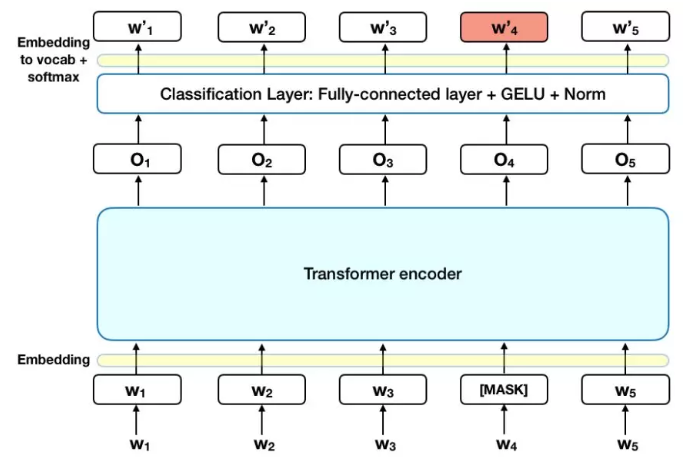

​	BERT 针对如何做“[MASK]”，做了一些更深入的研究，它做了如下处理：

> 1. 选取语料中所有词的 15% 进行随机 mask；
>
> 1. 选中的词在 80% 的概率下被真实 mask；
>
> 1. 选中的词在 10% 的概率下不做 mask，而被随机替换成其他一个词；
>
> 1. 选中的词在 10% 的概率下不做 mask，仍然保留原来真实的词。  

#### 3. Next Sentence Prediction 任务学习句子级别信息

​	具体做法则是将两个句子组合成一个序列，组合方式会按照下面将要介绍的方式，然后让模型预测这两个句子是否为先后近邻的两个句子，也就是会把"Next Sentence Prediction"问题建模成为一个二分类问题。

​	句子级负采样：

​	训练的时候，数据中有 50% 的情况这两个句子是先后关系，而另外 50% 的情况下，这两个句子是随机从语料中凑到一起的，也就是不具备先后关系，以此来构造训练数据。

​	Multi-task: 

​	在预训练阶段，因为有两个任务需要训练：Mask-LM 和 Next Sentence Prediction

### 输入表示

​	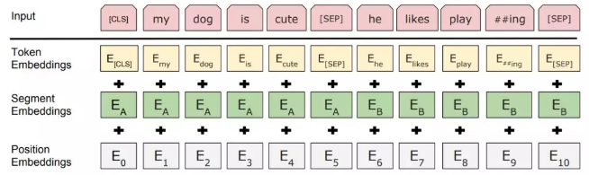

- 起始标记都用“[CLS]”来表示，结束标记符用"[SEP]"表示，对于两个句子的输入情况，除了起始标记和结束标记之外，两个句子间通过"[SEP]"来进行区分。
- 用两个向量表示当前是句子 A 或句子 B 的。引入了“segment embedding”的概念来区分句子。
- 引入序列中词的位置信息，也用了 position embedding。和Transformer的sin、cos函数编码不同，直接去**训练了一个position embedding**。给每个位置词一个随机初始化的词向量，再训练。

[CLS]作为句子/句对的表示是直接跟分类器的输出层连接的。

### 下游任务

​	NLP的四大任务：

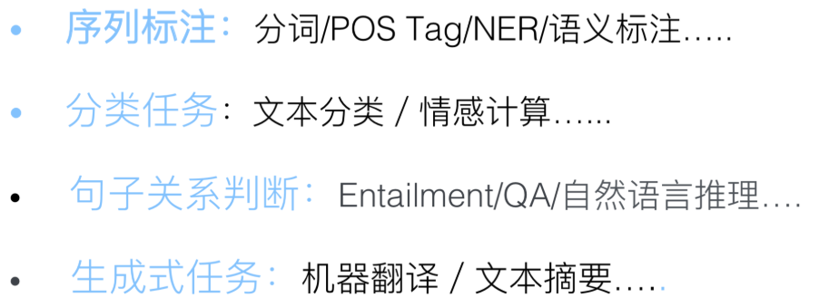

1. 对于**单序列文本分类任务和序列对的文本分类任务**使用框架基本一致，利用 Encoder 最后一层的第一个时刻“[CLS]”对应的输出作为分类器的输入
2. 对于 **SQuAD 1.1 任务**来说，需要在给定段落中找到正确答案所在区间，这段区间通过一个起始符与终止符来进行标记
3. **序列标注任务**上进行 finetune，对于序列中的每个 token 而言，实际上就是一个分类任务。和前面提到的普通分类任务不一样的是，这里的分类需要针对序列中的每个词做分类，参数增加在 H × K ，这里的 K 是序列标注中标注的种类个数。
4. 对于 SWAG 任务来讲，因为需要在给定一个句子后，从四个候选句子中选择一个最有可能是该句子的下一个句子，这里面通常包含了一些常识推理。将前置句子和四个候选句子分别进行组合成一个句子对, 给每一个候选句子进行打分，从而得到四个候选句子中最有可能是下一个的句子。

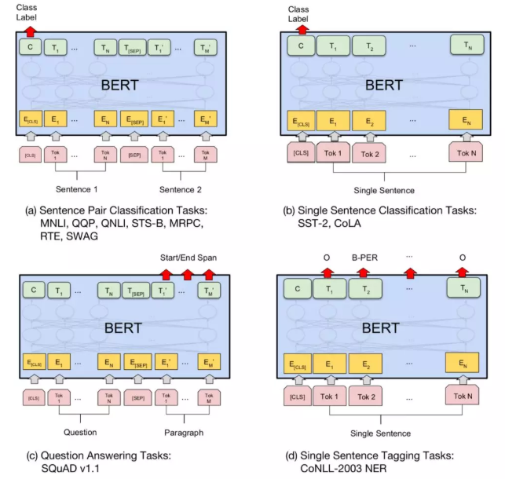

​	对比参数及训练

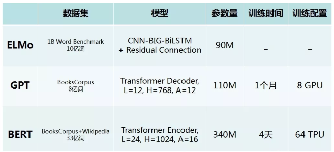

##  XLNet

​	在两阶段新模式（预训练+Finetuning）下，应该会有更多的好工作涌现出来。根本原因在于：这个模式的潜力还没有被充分挖掘，貌似还有很大的提升空间。

​	XLNet引入了自回归语言模型以及自编码语言模型的方法。

### 自回归语言模型（Autoregressive LM）

​	自左向右预测下一个词的语言模型任务，或者反过来自右向左，这种类型的LM被称为自回归语言模型。

​	GPT 就是典型的自回归语言模型。ELMo是分别有两个方向的自回归LM，然后把LSTM的两个方向的隐节点状态拼接到一起，体现双向语言模型。其实是两个自回归语言模型的拼接，本质上仍然是自回归语言模型。

#### 优点

1. 下游NLP任务有关，比如生成类NLP任务，文本摘要，机器翻译等，在实际生成内容的时候，就是从左向右的，自回归语言模型天然匹配这个过程。
2. Bert这种DAE模式，在生成类NLP任务中，就面临训练过程和推断过程（没有Mask）不一致的问题，导致生成类的NLP任务到目前为止都做不太好。

> PS：
>
> 1. DAE（DA Enhanced），Denoising Autoencoder：那些被Mask掉的单词就是在输入侧加入的所谓噪音。类似Bert这种预训练模式，被称为DAE LM
> 2. AoA, 层叠式注意力机制（Attention-over-Attention）

#### 缺点

​	只能利用上文或者下文的信息，不能同时利用上文和下文的信息。ELMo这种双向都做，因为融合模式过于简单，所以效果其实并不是太好。

> ​	GPT 2.0的作者却坚持沿用GPT 1.0 单向语言模型的旧瓶，装进去了更高质量更大规模预训练数据的新酒。
>
> 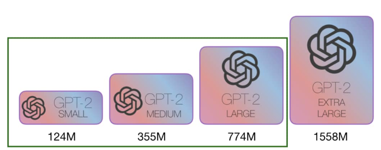
>
> ​	而它的实验结果也说明了，如果想改善预训练语言模型，走这条扩充预序列模型训练数据的路子，是个多快好但是不省钱的方向。

### 自编码语言模型（Autoencoder LM）

​	DAE LM的优缺点正好和自回归LM反过来，它能比较自然地融入双向语言模型。

​	Bert的缺点，主要在输入侧引入[Mask]标记，导致预训练阶段和Fine-tuning阶段不一致的问题，因为Fine-tuning阶段是看不到[Mask]标记的。

​	XLNet的出发点就是：

> 1. 能否融合自回归LM和DAE LM两者的优点。
> 2. 另外一个是，Bert在第一个预训练阶段，假设句子中多个单词被Mask掉，这些**被Mask掉的单词之间没有任何关系，是条件独立的**，而有时候这些单词之间是有关系的，XLNet则考虑了这种关系

​	XLNet共有三个因素：

1. Permutation Language Model(简称PLM)：将双向信息学习方式，由预测[Mask]，变成对序列进行全排列，根据每种可能排序由前t - 1个词预测第t个词。来融入双向语言模型。
2. 引入了Transformer-XL：相对位置编码以及分段RNN机制。相对位置编码关注相对位置偏差。分段RNN机制，将长文本划分为较短的文本输入transformer，将transformer单元作为RNN的cell，进行RNN方式的序列运算连接。
3. 增加了预训练阶段使用的数据规模：Bert使用的预训练数据是BooksCorpus和英文Wiki数据，大小13G。XLNet除了使用这些数据外，另外引入了Giga5，ClueWeb以及Common Crawl数据，并排掉了其中的一些低质量数据，大小分别是16G,19G和78G。可以看出，在预训练阶段极大扩充了数据规模，并对质量进行了筛选过滤。

​	对于长文档的应用，Bert因为**Transformer天然对长文档任务处理有弱点**，所以XLNet对于长文档NLP任务相比Bert应该有直接且比较明显的性能提升作用，它在论文中也证明了这点。

## 总结

​	如何使用这些预训练好的模型。一般来说，可以有三种方式来使用：

1. 将预训练模型当做一个特征提取器，直接将预训练模型的输出层去掉，然后使用去掉输出层之后的最后一层输出作为特征，输入到我们自己精心设计好的 Task-specific 模型中去。

   >  	在训练过程中，作为特征提取器的部分（比如 BERT Encoder）的参数是不变的。

2. 将预训练模型整体接入 Task-specific 模型，继而重新在新的数据集上整体重新训练。

   >  	当然训练技巧可以有很多种，比如 ULMFiT 的三角学习率和逐层解冻或者是 Transformer 的 warmup 策略（上文都有提到），这些训练技巧非常重要，需要好好把控，否则很容易学崩了，甚至让原有预训练语言模型的优势都被新的 finetune 抹去了，因此需要实验设计一个比较好的 finetune 策略。

3. 保留预训练模型的一部分，另外一部分则和 Task-specific 模型一起 finetune。

   >  	训练数据不算太多的情况，这个时候一方面要保证预训练模型在大规模语料上曾经学习到的表征，另一方面因为又要做新数据下的迁移，但是数据量比较少，重新 finetune 整个模型可能不太合适，容易导致模型的鲁棒性不高，那么似乎选择最后的一些层进行选择性的 finetune 会是比较好的方案

​    以 BERT 为代表的做法，实际上是简单粗暴的代名词，它们把人类语言习得过程中的轻量、泛化和低功耗，用大数据、大模型和大计算量炮轰的荡然无存。