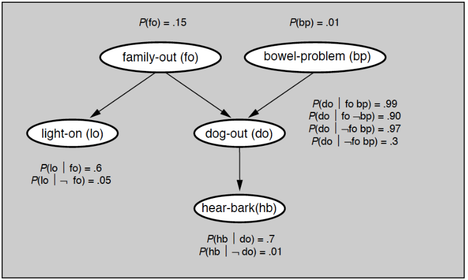
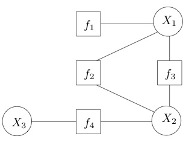
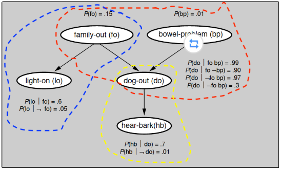

## **推断**（inference）

**推断**（inference）是利用图结构表示的联合分布来计算某个变量的概率，得到关于目标问题的数字化结论。


在概率图模型中，**因子分解**与**条件独立性**这两大法宝可以大量节约概率运算，给推断问题带来简洁高效的解法。


概率图中的推断可以分为两类：**精确推断和近似推断**。精确推断（exact inference）是精确计算变量的概率分布，可以在结构比较简单的模型中实现；近似推断（approximate inference）则是在不影响推理正确性的前提下，通过适当降低精度来提高计算效率，适用于结点数目多、网络结构复杂的模型。


## 精确推断

**精确推断最基本的方法是变量消除**（variable elimination），这种方法对“与待求解的条件概率**无关的变量**”进行**边际化处理**，也就是将中间变量约掉，从而计算出目标概率。



​																				贝叶斯网络实例

 如果要用变量消除法计算变量 hb 的分布，就得把除 hb 之外的所有变量挨个消除。 


$$ψ1(fo,do)=∑bpp(bp)p(do|fo,bp)$$

$$ψ2(do,lo)=∑foψ1(fo,do)p(fo)p(lo|fo)$$

$$p(hb)=∑doψ3(do)p(hb|do)=∑dop(hb|do)∑lo∑fop(fo)p(lo|fo)∑bpp(bp)p(do|fo,bp)$$

 

从上面的过程可以看出，变量消除的过程就是不断对中间变量穷举并求和（**variable summation**），整个过程通过对因子的操作实现。 

 如果在目标变量 X 和单个中间变量 Y 上共同定义出因子函数 $ϕ(X,Y)$，那么对 Y 的穷举求和就可以表示为 $ψ(X)=∑Yϕ(X,Y)$，也就是对因子函数的**边际化**（**factor marginalization**） 

 如果随机变量 Y 在多个因子 $ϕ1(X,Y),ϕ2(Z,Y),$⋯ 中都出现的话，就需要综合考虑这个变量的整体作用，也就是将所有包含这个公共变量的不同因子相乘（**factor multiplication**）。这样做相当于将单个变量“孤立”出来，它产生的所有影响都体现在因子函数的乘积之中，对所有因子函数的乘积统一进行边际化就可以彻底消除变量 Y 的所有影响。 


 这样的的求解方法建立在“因子乘积 - 变量求和”的步骤上，因而被称为和积变量消除（**sum-product variable elimination**） 

>  在预测问题中，已知的 lo=0 和 hb=1 被称为证据（evidence）。基于证据的推断本质上是计算非归一化的联合分布 p(fo,lo=0,hb=1)，利用贝叶斯网络的性质可以证明，这个分布其实是个吉布斯分布，起到归一化作用的常数 p(lo=0,hb=1) 则可以看成是约化因子（reduced factor）。 


**问题在于**： 如果图模型的规模较小，结点的数目较少，直接利用全概率公式进行求和或求积分，就可以计算出每个结点的边缘概率。但当结点数目增加时，和积变量消去的计算量会以**指数形式增长**。从运算效率的角度对变量消去加以改进，得到的就是**置信传播算法**。 


##  置信传播（belief propagation） 

 置信传播（belief propagation）也是精确推断的算法，它将图模型中**每个节点的概率分布**传递给**相邻的节点**，以此**影响相邻节点**的概率分布状态，经过一定次数的迭代，每个节点的概率分布将**收敛到一个平稳分布**。

这种算法适用于包括贝叶斯网络和马尔可夫随机场在内的所有概率图模型 。


### 因子图（factor graph）

 因子图（factor graph）是一类二分图，用来表示对函数的因子分解，其中的结点分为变量结点（variable node）和因子结点（factor node）两种，相关的结点之间则由无向边连接。

假定一个因子图表示的是函数 $g(x1,x2,x3)=f1(x1)f2(x1,x2)f3(x1,x2)f4(x2,x3)$，那它的结构就如下图所示。因子图能够更加直观地刻画函数的可分解性，贝叶斯网络和马尔可夫随机场也都可以表示成因子图。 



###  message

置信传播算法的核心概念是消息（message），它是结点之间信息流动的载体。 

1.  从变量 v 到因子 a 的消息是来自除 a 之外所有与 v 相邻因子的消息乘积，如果 v 没有除 a 之外其他的邻接因子，其消息就被设置为均匀分布。 
2.  从因子 a 到变量 v 的消息就复杂一些，它先要对除来自 v 外，进入 a 的所有变量消息相乘，再对乘积边际化掉所有除 v 之外和 a 邻接的所有变量，这在本质上和变量消除的和积算法是一致的。
3.  每个变量的置信度就是根据这样的准则在图结构中往返流动，不断更新。 
4.  如果经过多轮迭代后，图模型的因子收敛到稳态，这时就可以计算单个结点的边际概率。 
   -  每个结点的**边际概率**都正比于和它**相邻的所有因子传递给它的消息的乘积**，**归一化**处理后就可以得到**真正的概率**。


 置信传播算法在理论上并不保证对所有图结构都能收敛，但当图模型具有树结构时，计算出的概率分布一定会收敛到真实值，从而实现精确推断。 


### clique tree

 团树（clique tree）也叫联结树（junction tree），是一种通过变量连接的结构。其特点是如果一个变量出现在树结构的两个团中，那它就一定会出现在连接这两个团的路径上的所有团中。 


 消息的传递需要经过两个步骤：

第一个步骤是收集（collection），指的是所有叶结点向根结点传递消息，直到根结点收到所有邻接结点的消息，这是消息汇总的过程；

第二个步骤是分发（distribution），指的是根结点向叶结点传递消息，直到所有叶结点均收到消息，这是消息更新的过程。

这样的一来一回之后，团树的每条边上都有不同方向的两条消息，基于这些消息就能计算出所有变量的边际概率。 


 和变量消除相比，**置信传播的优势在于提升了计算效率**。变量消去算法的缺点在于一次变量消去只能求出本次查询变量的条件分布，不同的查询将带来大量的重复计算。在团树中流动的每个消息都相当于对一组关联因子的封装，查询不同变量时只需调用相关的封装就可以了，从而避免了复杂的重复运算。 


## 应用

在 pgmpy 中，团树被定义为 models 模块中的 JunctionTree。利用 BayesianModel 类中的 to_junction_tree 函数可以将现有的贝叶斯网络转换成团树，转换出的团树就可以使用 inference 模块中的 BeliefPropagation 类来求解。 



```python
from pgmpy.models import BayesianModel, JunctionTree
from pgmpy.factors.discrete import TabularCPD
from pgmpy.inference import BeliefPropagation

model = BayesianModel()
model.add_nodes_from(['family_out', 'bowel_problem',
                      'light_on', 'dog_out', 'hear_bark'])
model.add_edge('family_out', 'light_on')
model.add_edge('family_out', 'dog_out')
model.add_edge('bowel_problem', 'dog_out')
model.add_edge('dog_out', 'hear_bark')

cpd_fo = TabularCPD(variable='family_out', variable_card=2,
                    values=[[0.15], [0.85]])
cpd_bp = TabularCPD(variable='bowel_problem',
                    variable_card=2, values=[[0.01], [0.99]])
cpd_do = TabularCPD(variable='dog_out', variable_card=2,
                    values=[[0.99, 0.9, 0.97, 0.3], [0.01, 0.1, 0.03, 0.7]],
                    evidence=['family_out', 'bowel_problem'], evidence_card=[2, 2])
cpd_lo = TabularCPD(variable='light_on', variable_card=2,
                    values=[[0.6, 0.05], [0.4, 0.95]], evidence=			  ['family_out'], evidence_card=[2])
cpd_hb = TabularCPD(variable='hear_bark', variable_card=2,
                    values=[[0.7, 0.01], [0.3, 0.99]], evidence=['dog_out'], evidence_card=[2])

# integrity checking
model.add_cpds(cpd_fo, cpd_bp, cpd_do, cpd_lo, cpd_hb)
model.check_model()

junction_tree = model.to_junction_tree()
print(junction_tree.nodes())

infer_bp = BeliefPropagation(junction_tree)
print(infer_bp.query(['family_out'], evidence={
      'light_on': 0, 'hear_bark': 1})['family_out'])

```


## 


## 总结

- 推断是利用图结构表示的概率分布计算查询变量的概率，可以分为精确推断和近似推断；
- 变量消除通过对非查询变量的边际化处理实现精确推断，具体步骤包括因子乘积和变量求和；
-  置信传播通过消息传递实现精确推断，具有较高的计算效率；
- 将图模型改造成团树结构可以保证置信传播算法的收敛性
