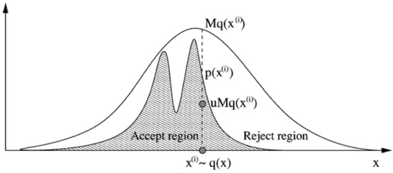

##  随机性近似

确定性近似是遵循着一定的原则，使用一个分布来近似另一个分布，近似结果取决于确定的规则。

可是在很多预测任务中，完整的后验分布并不是必需的，我们关注的对象只是某个因变量在后验分布下的期望，或者具有最大后验概率的那个取值。这时再使用确定性近似来计算预测结果，但连续函数在连续分布下的预测计算仍然比较困难。 

有些时候，即使目标分布的形式是已知的，对它的求解也存在着困难。就拿常见的 Beta 分布来说，其概率密度可以表示为 $p(x) =  Cx^{\alpha - 1}(1 - x)^{\beta - 1}$，其中常数 $\alpha, \beta$ 都是分布参数，常数 $C$  是归一化因子。可问题在于如果不能计算出这个复杂的参数 $C$，即使能够确定分布的形状，也没法对分布进行直接的采样。这种情况下也要借助随机性近似。 


 求解解析解既复杂繁冗又无甚必要 ， 抽样来解决问题。 

 **用样本分布来代替难以求解的后验分布，这就是随机性近似的思想**。 

> 随机性近似（stochastic approximation）属于**数值近似**（numerical approximation）的范畴，它对数据的生成机制进行建模，通过模型生成符合真实分布的抽样结果，再利用这些抽样结果表示未知的概率分布。


##  MCMC

 **典型方法是马尔可夫链蒙特卡洛方法**（Markov Chain Monte Carlo method） 。

- 在概率空间中构造合适的马尔科夫链，再应用蒙特卡洛方法进行随机采样来拟合目标的分布。 


 **MCMC 体现的是真正的概率密度的思想**，它虽然不能计算分布的表达式，却可以将概率等比例地放大。频率意义下的概率就是数据出现的频度，归一化的作用只是让它变成公理化的概率，而不会对频率解释产生任何影响。 


MCMC 的出发点就在于**消除掉那个不影响分布趋势却又没它不行的归一化常数 $C$ 对概率求解的影响**，通过对简单分布（比如均匀分布）进行抽样来拟合出更加复杂，甚至于压根儿不存在解析式的分布形式。


##  马尔可夫链和蒙特卡洛方法

 马尔可夫链和蒙特卡洛方法却是两个完全不同的概念 。

###  蒙特卡洛方法

**通过多次独立重复的随机实验来模拟确定性的概率分布，或者求解难以计算的求和问题，其精确性由大数定律所保证**。 

>  蒙特卡洛方法最广为人知的应用可能就是对圆周率 $\pi$ 的估算：在一个单位面积的正方形里随机且均匀地抛洒若干个点，然后统计这些点中和某个选取出的顶点之间距离小于 1 的点的数目。 
>
> - 如果将这个选出来的参考顶点视为圆心，那么和它的距离小于 1 的这些点就都在四分之一圆内，四分之一圆内的点数和所有点数的比例就是 $\pi / 4$ 的估计值。当随机生成的点数达到 30000 时，$\pi$ 的估计误差可以下降到 0.07% 以下。 											

 使用蒙特卡洛方法估计未知的目标分布 $p(x)$ 时，可以先引入另一个概率分布 $q(x)$ 作为参考分布，这个参考分布被称为**建议分布**（proposal distribution），具有简单的形式和易于采样的特性。

与建议分布配套的还有个常数 $M$，两者共同满足 $Mq(x) \ge  {\tilde p}(x)$，这里的 ${\tilde p}(x)$ 是未归一化的概率，是目标分布 $p(x)$ 与另一个常数 $Z$ 的乘积。 

 如果将上面的两个准概率分布画在同一个坐标系里，$Mq(x)$ 对应的曲线会将 ${\tilde p}(x) = Zp(x)$  对应的曲线完全包住，两者之间会存在一段间隔。



​																					拒绝采样示意图

( 由于需要根据样本的特性决定接受或是拒绝，因而以上的采样机制被称为**拒绝采样**（rejection sampling） )

步骤：

> 1. 在执行采样时，首先按照概率分布 $q(x)$ 生成一个随机数 $x_0$
> 2. 接着在 $[0,  Mq(x_0)]$ 的区间上通过均匀采样采出来一个新数 $u_0$
> 3. 如果得到的 $u_0$ 大于 ${\tilde  p}(x_0)$，那它就落在两条曲线之间的区域，这样的样本会被直接抛弃
> 4. 如果 $u_0$ 小于 ${\tilde p}(x_0)$，那它就落在  ${\tilde p}(x)$ 曲线的下方，这样的样本才会保留。 

${\tilde p}(x)$ **是未归一化的概率（没有除以C的部分），$q(x)$ 建议分布（proposal distribution）**


可以证明，拒绝采样等效于对目标分布 $p(x)$ 进行多次独立的采样。

**问题在于**：一般说来，即使对系数 $Z$ 进行优化处理，拒绝采样也会有**较高的拒绝率**，其运算**效率通常较低**。 


### **马尔可夫链** 

 蒙特卡洛方法只是随机采样的过程，而要确保采出来的样本服从我们想要的分布，需要借助第一个 MC：**马尔可夫链** 

>  马尔可夫链假定每一时刻的状态只依赖于前一时刻的状态，每一个状态又会以一定的概率变化为另一个状态，状态之间所有的转化概率共同构成了这个马尔可夫链的状态转移矩阵（transition matrix）。 

 **转移矩阵可以将任意的初始概率分布变成马尔可夫链的稳态分布**（equilibrium distribution）。

稳态分布由转移矩阵决定，而与初始的概率分布无关，不管每个状态的初始概率如何，**满足要求的MC** (满足regularity) 经过若干轮次的转换之后，都可以得到符合稳态分布的样本。

这意味着只要计算出某个稳态分布所对应的马尔科夫链的**状态转移矩阵**就行。


###  MCMC 最原始的实现——**Metropolis 算法** 

 Metropolis 算法可以看成是结合了马尔可夫链的**拒绝采样**，它将原始的数据点初始化为 $x^{0}$，将转移概率初始化为 $q(x |  x^{0})$。需要注意的是，Metropolis 算法中的转移概率**必须具备对称的特性**，也就是 $q(x | y) = q(y | x)$  对任意的 $x$ 和 $y$ 都成立。 

> 1. 在每一轮数据的生成中，Metropolis 算法会根据上一轮的结果 $x^{t}$ 和以建议分布 $q(x)$ 的形式出现的转移概率 $q(x |  x^{t})$ 生成 $x’$，以 $\alpha = {\tilde p}(x’) / {\tilde  p}(x^{(t)})$ 的概率被接受。
> 2. 在实现中，接受的策略体现为生成一个在 [0, 1] 上均匀分布的随机数 $u$，如果 $u <  \alpha$ 就接收新样本，反之则继续使用上一轮次的旧样本。
> 3. 如果新样本的出现引起了 ${\tilde p}(\cdot)$ 的增加，也就是  $\alpha > 1$ 的话，这样的新样本就是必然被保留的。

在模拟分布时，会在概率密度大，也就是数据出现频度高的位置频数更高。而在概率密度小，数据出现频度低的位置较少。以频数表示概率密度的分布。


**问题在于**：在生成新样本时**更倾向于**接收那些来自**分布集中区域**的样本。如果新样本导致**准概率密度的增加**，那它就 **100%  会被接受**。可如果导致准概率下降，新样本就存在被丢弃的可能，下降的程度越大，被接受的概率就越低，这将会导致生成的样本更容易**抱团在一起**。


### **Metropolis-Hastings 算法**

将原始 Metropolis 算法的中建议分布的**对称特性**$q(x | y) = q(y | x)$去掉，得到的就是广泛应用的**Metropolis-Hastings 算法**。

> 马尔可夫链的特性决定了**根据给定的状态矩阵确定对应的稳态分布**是小菜一碟。
>
> 可**根据给定的稳态分布找到对应状态矩阵**的难度却有如大海捞针。

为了简化寻找转移矩阵的难度，MH 算法利用了稳态分布的一个充分非必要条件，那就是**细致平稳性**（detailed balance）：

$π(i)Q_{ij} = π(j)Q_{ji}$

其中 $\pi$ 是马尔可夫链的稳态分布，$\bf Q$ 是马尔可夫链的转移矩阵。这个式子的含义在于从状态 $i$ 转移到状态 $j$  的概率质量恰好等于从 $j$ 转移回 $i$ 的概率质量，转入和转出之间存在动态平衡，分布 $\pi$  就是稳态分布。


但在具体问题中，任意选择的**目标分布** $p(x)$ 和起到**转移矩阵**作用的**建议分布** $q(x)$  **很难满足细致平稳性**，这时就需要对它们做一些人为的修正，**修正方式是引入参数 $\alpha$**，令它满足:

$ p(i)Q(i,j)α(i,j) = p(j)Q(j,i)α(j,i) $

参数的引入使转移矩阵被修正为 ${\bf Q}(\cdot)\alpha(\cdot)$，这可以避免 Metropolis  算法对小概率样本的一刀切。在 MH 算法中，参数 $\alpha$ 就是转移结果的**接受率**

> 要让接受率满足上面的条件，最简单的方式是设定两者之中较大的一个为 1，再利用等式关系计算出另外一个，这样生成的样本分布  $p(z)$ 就是马尔可夫链的稳态分布。


### 吉布斯采样

MH 算法的一个特例是针对高维分布的**吉布斯采样**（Gibbs sampling）。在一个 $N$  元分布中计算每个变量关于其他所有变量的条件分布，可以得到 $N$  个一元条件分布。

吉布斯采样就是对这些条件分布进行采样：在给定初始值后，吉布斯采样按照每个一元条件分布依次产生新的样本并全部接受，作为下一轮更新的基础。

> 吉布斯采样来源于对吉布斯随机场（Gibbs random  field）的研究，它相当于将一个高维的马尔可夫链庖丁解牛，拆解成多个一维的马尔可夫链，高维马尔可夫链整体的状态转移也相应地被拆解成不同一维链轮流的状态转移。这样的拆解并不会影响到细致平稳条件，因而得到的分布依然是目标的稳态分布。


**吉布斯采样并不会拒绝产生的样本，这使它和 MH 算法相比具有效率上的优势，从而成为应用最广泛的 MCMC 算法**。


## 应用

```python
import numpy as np
import pymc3 as pm
import scipy.stats as stats
import matplotlib.pyplot as plt

# n as number of toss and z as number of heads
n = 50
z = 20

# Parameter values for Beta prior and Beta posterior
alpha_prior = 12
beta_prior = 12
alpha_post = 32  # 12 + 20
beta_post = 42  # 12 + 30

# iterations of the Metropolis algorithm，as many as possible
iter_num = 100000

basic_model = pm.Model()
with basic_model:
    theta = pm.Beta("theta", alpha=alpha_prior, beta=beta_prior)
    y = pm.Binomial("y", n=n, p=theta, observed=z)
    # MAP estimation as initial value for MCMC
    initial = pm.find_MAP()
    transition = pm.Metropolis()
    trace = pm.sample(iter_num, transition, initial,
                      random_seed=1, progressbar=True)

plt.hist(trace["theta"], bins=50, histtype="step",
         normed=True, label="Posterior (MCMC)", color="red")
x = np.linspace(0, 1, 100)
plt.plot(x, stats.beta.pdf(x, alpha_post, beta_post),
         label='Posterior (Analytic)', color="blue")

plt.xlabel("$\\theta$, Fairness")
plt.ylabel("Density")
plt.legend()
plt.show()

```


## 总结

- MCMC 是基于随机性近似的推断方法；
- MCMC 利用基于蒙特卡洛方法的随机采样将任意的初始分布转化为马尔可夫链的稳态分布；
- MCMC 的关键问题是找到和目标稳态分布匹配的转移矩阵；
- MCMC 的典型方法包括一维的 MH 算法和多维的吉布斯采样。

在 MCMC 中，**转移概率或者建议分布 $q(x, y)$ 的选择是关键因素**，其设计的优劣会直接影响到算法的性能。