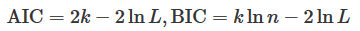

 **结构学习**（structure learning）的任务是找到与数据匹配度最高的网络结构，需要同时学习未知图模型的结构和参数。 

 **结构学习的任务是根据训练数据集找到结构最恰当的模型**，这无疑比参数学习要复杂得多，也有更多的不确定性。 

 对图模型进行结构学习的目的有两个。

- 一方面在于**知识发现**（knowledge discovery），根据因变量的结果来**判定自变量之间的依赖**关系；
- 另一方面则在于**密度估计**（density estimation），估计出**数据分布的特性**，据此对新样本进行推断。 

 主要有三种，分别是**基于约束的学习**、**基于评分的学习**和**基于回归的学习**，这三种方法都可以应用在有向的贝叶斯网络和无向的马尔可夫随机场中 。（简介）

###  **基于约束的结构学习**（constraint-based structure learning） 

 **基于约束的结构学习**（constraint-based structure learning）将贝叶斯网络视为条件独立性的表示 。

 首先从数据中识别出一组条件独立性作为约束，然后尝试找到最符合这些约束的网络结构。

基于约束的学习与贝叶斯网络的结构特征密切相关，但它缺乏类似于似然函数的显式目标函数，因而**不能直接找到全局的最优结构**。 

>  **典型算法是 SGS 算法** ： SGS 采用遍历式的方法来判定结点之间是否应该有边存在，它首先在结点集合上构造出全连接的无向图，再对图中多余的边做出删减。 再 通过审核的每条边确定方向 
>
>  SGS 算法最大的问题在于**运算复杂度**，其运算量会随着结点数目的增加以超指数的方式增长，因而不具备可扩展性。 

###  **基于评分的结构学习**（score-based structure learning） 

 **基于评分的结构学习**（score-based structure learning）**把结构学习问题处理为模型选择问题**。将图模型与数据的匹配程度定义为评分函数（score function），从所有可能的结构中搜索出评分最高的那个作为结果。 

 首要任务是**选择合适的评分函数**。  评分函数决定了数据和结构之间的拟合程度 。

>  如果将学习问题看作最优编码问题，就可以定义出最小描述长度作为评分函数。 
>
> **1. 最小描述长度**（minimal description length）借鉴了信息熵的概念，其目标是找到一个能以最短编码长度描述训练数据的模型。 
>
> 网络中的参数越多，似然概率的表示就越精确，但过拟合的风险也会越大。 
>
> 
>
>  **2. 赤池信息量准则**（Akaike information criterion）和**贝叶斯信息量准则**（Bayesian information criterion）也是基于信息论的评分函数。
>
> 它们都将评分表示成“模型 + 数据”的组合，其形式可以看成是给模型下的对数似然概率 $\ln L$ **添加了和模型参数数目有关的正则化项**。 
>
>  赤池信息量准则的正则化项是**参数数目** $k$ 乘以常数系数，而贝叶斯信息量准则的正则化项则是参数数目 $k$ 乘以**样本容量** $n$ 的对数 ：
>
> 

>  设计评分函数时，如果将数据和模型融合在一起，得到的评分函数就是**贝叶斯狄利克雷评分**（Bayesian Dirichelet），这个函数可以写成对狄利克雷分布的求和。 

####  评分函数上的最优解 

 由于评估所有备选结构的分数难以实现，因此在搜索时，通常使用启发式算法来查找次优结构。贪婪搜索、遗传算法、进化规划、模拟退火算法和蚁群算法等启发式算法都可以应用在最优结构的搜索中。 

###  **基于回归的结构学习**（regression-based structure learning） 

 这类算法的出发点是将目标函数表示为**图模型参数的线性组合**，再对线性模型进行 **$L_1$ 或 $L_2$ 正则化**处理来控制模型的复杂度。

其**优势在于可以确保目标函数最优解的存在性，明确了学习问题的意义，同时还具有良好的可扩展性**。 

>  最直接的方式是将图结构关于数据的对数似然定义为目标函数，并使用拉普拉斯先验来简化模型。
>
> 结点之间的独立性也可以用 LASSO  回归来估计，这通常被应用于建模连续变量的高斯图模型（Gaussian graphical  model）中：目的是确定给定结点的马尔可夫毯，线性系数不为 0 的其他结点和目标结点之间都存在依赖关系。 

### 存在隐变量的情况

 如果模型中存在隐变量，结构学习的难度也会大大增加。将专门处理隐变量的 EM 算法引入到结构学习之中，得到的就是**结构 EM（Structural EM）算法**。

 

 结构 EM 算法在具有结构和参数两个维度的假设空间内进行搜索：

在每一轮次的搜索中，**原始的 EM** 算法是为**固定的模型更新参数**，**结构 EM** 算法则**同时更新参数和模型**，更新的方式是让模型的评分函数最大化。

### 总结

-  结构学习的任务是找到与数据匹配度最高的网络结构，需要同时确定图模型的结构和参数；
- 基于约束的结构学习通过条件独立性的约束确定贝叶斯网络的结构，需要先后确定边的存在性和方向；
- 基于评分的结构学习通过数据和结构的匹配度确定贝叶斯网络的结构，包括选择评分函数和搜索最优结构两个步骤；
-  对不完备数据实施结构学习可以使用结构 EM 算法。

以上方法都是**频率主义**下的方法。

要使用贝叶斯来进行结构学习，就得先给所有备选模型和所有参数设定先验，再用训练数据去调整先验。显然，这类方法要在所有可能的模型中进行搜索比较，其**实用性非常差**。

> **简化贝叶斯结构学习**的方式有两种，一种叫**贝叶斯模型选择**（Bayesian model selection），直接选择最像的模型当作真实模型来使用；另一种叫**选择性贝叶斯模型平均**（selective Bayesian model averaging），将搜索的范围限制在人为选定的一组模型之中。

