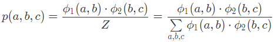
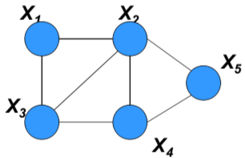
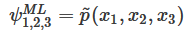
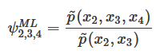
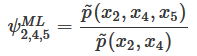

 在推断任务中，我们会根据已知的模型来确定实例的特性，模型的结构和参数都作为输入的一部分出现。

**学习任务**（model learning）则是将推断任务的过程颠倒过来，根据数据来构造出能够反映数据潜在规律的模型，也就是对概率图模型的训练。 

 概率图模型的学习和其他的机器学习一样，都属于**自动化的建模方式**。

构造概率图模型的依据是**变量之间的依赖关系**，这些依赖关系的建立则需要仰赖垂直领域的**先验知识**。 

##  **参数学习**和**结构学习** 

**参数学习**（parameter learning）是在**已知图模型结构的前提下估计其参数**，也就是节点之间的条件概率，这可以看成是个数值优化问题。

**结构学习**（structure learning）是在**图模型完全未知的情况下先确定其结构**，**再根据结构来计算参数。**结构学习可以看成是针对结构和参数的联合优化，可以存在单一的全局最优解。

##  参数学习 

 分为**对贝叶斯网络的学习**和**对马尔可夫随机场的学习** 。

####  贝叶斯网络 

 每一对节点之间都定义了归一化的条件概率分布，因此学习任务针对的是每个**单独的局部**。

####  马尔可夫随机场 

 归一化操作是通过全局化的配分函数来完成的。

**参数的全局耦合性**使得这个复杂的任务不能被分解成若干简单任务的组合，造成了更大的学习难度。 

## **不存在隐变量时**

### 贝叶斯网络

**利用完全观测的数据估计贝叶斯网络的参数**。

#### 频率主义

 从频率主义出发，可以基于似然概率最大化来实现参数的估计。最大似然估计的目标是找到让现有数据出现的概率、也就是似然函数最大化的那一组参数。

根据贝叶斯网络的局部特性，全局似然函数可以被拆解成一些独立的局部似然函数的乘积，每个独立项都对应着网络中的一个条件概率分布，这就是**似然函数的全局分解**（global decomposition）。 

>  基于全局分解可以单独对每个局部似然函数进行最大化，而无需考虑其他局部结构的影响，将每个局部似然函数的最优参数合并在一起，得到的就是全局似然函数的最优解。 

比如， **朴素贝叶斯分类器** 

####  贝叶斯主义 

 先给每个参数设定先验分布，以实现最大后验估计。

表示先验分布的变量，与现有贝叶斯网络的数据和结构独立，与原始的贝叶斯网络共同形成新的元网（meta-network）。

> 可以证明，如果不同参数的**先验分布是相互独立的**，那么它们的**后验分布也会继承这种独立性**，所以对最大后验估计的求解也可以**遵循从局部到整体的方式**，这和最大似然估计是一致的。 

### 马尔可夫随机场 

考虑一个最简单的马尔可夫随机场 $A – B – C$。

这个图模型中的势函数有两个，分别是 $\phi_1(A, B)$ 和  $\phi_2(B, C)$，它的配分函数 $Z$ 等于所有两个势函数的乘积对变量 $A, B, C$ 所有可能的取值进行求和。

在给定一组数据  $a, b, c$ 时，这个实例的似然概率可以写成 ：

#### 配分函数带来的难度

在对这个式子进行最大化时，就不能对 $\phi_1(a, b)$ 和 $\phi_2(b, c)$ 分开处理，各自求解最大值了。

因为配分函数  $Z$ 是由所有的参数共同决定的，无论是 $\phi_1(a, b)$ 还是 $\phi_2(b, c)$ 发生变化，都会导致 $Z$  发生变化。

> 配分函数就像一条履带，将这两个因子像两个齿轮一样扣在一起，并将一个的变化传导给另一个，让**两者必须作为一个整体来加以优化**。 

####  对数似然函数是凸函数

 模型的参数可化为对数线性模型中的权重，并通过对权重似然函数的最优化来实现参数学习。 

 利用划分函数是关于待估计参数的**凸函数**这一条件，可以证明**对数似然函数是单峰函数，只有全局最优而没有局部最优**。 

 但问题是单凭这个准则不能给出问题的解析解，要计算出最优参数必须借助梯度法等最优化的方法。 

####  分解马尔可夫随机场 

 如果马尔可夫随机场的图结构是**弦图**（chordal graph），那它就是可分解的（decomposable）。 

>  弦图是指无向图中任意长度大于 3 的环路中都至少存在一条弦，也就是连接环路中不相交的顶点的无向边。
>
>  

 马尔可夫随机场可以被划分成不同的团，每个团的势函数都可以被初始化为**经验边际函数**（empirical marginal）。

 以上面的弦图为例，结点 $X_1, X_2, X_3$ 构成了一个团，其势函数可以表示为经验边际 ：

如果这个团和其他团之间**存在公共节点**，那么它的势函数还要除以公共结点的经验边际函数。

利用这种经验方式计算出每个团的势函数后，将得到的结果相乘，其结果就是最大似然估计的结果。 

####  **迭代比例拟合**（iterative proportional fitting） 

 如果图结构本身是不可分解的，模型的学习就要借助于更一般的方法，迭代比例拟合就是这样的一种方法。 

 **迭代比例拟合**（iterative proportional fitting）可以在**给定经验边际**的条件下**求解未知的势函数**。

具体的方法是：一个一个地去满足经验边际的约束，但满足下一个约束可能破坏上一个约束，所以需要通过迭代来逼近所有的边际条件。 

#### 计算复杂度

马尔可夫随机场的运算成本较高，要简化运算的话：

1. 既可以使用**近似推理过程计算梯度**
2. 也可以使用**其他目标函数来代替似然函数**。

>  代替似然函数的目标函数则包括伪似然函数、对比散度和最大间隔函数等，其中的对比散度已经被用于受限玻尔兹曼机的训练中 

**近似推理是将学习问题当成推断问题来解决**，包括传播近似推理和抽样近似推理两种技术：

1. 传播近似推理是将**信念传播算法**应用在马尔可夫随机场的学习中
2. 抽样近似推理则通常借助 **MCMC**，用平稳分布作为参数后验分布的估计

## 总结

- 参数学习的任务是在已知模型结构的前提下估计其参数，可以看成是模型的训练；
- 贝叶斯网络的参数学习可以由整体分解为局部，在局部上应用最大似然估计或者最大后验估计；
- 马尔可夫随机场的参数学习不能分解，也不存在解析解，可以使用通用的迭代比例拟合方法找到全局最优解；
- 马尔可夫随机场的参数学习可以通过近似推理和目标函数替换加以简化。