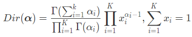

 在机器学习任务中，输入和输出之间并不是简单的一对一的决定关系，两者之间通常存在着一些可见或不可见的**中间变量**。

要计算输出变量的概率分布，就得把这些中间变量纳入到建模的框架之中。

表达多个变量之间的复杂的相关关系，**图模型**是理想的选择。

将图模型和概率模型结合起来——**概率图模型**（probabilistic graphical model）


##  最简单的概率图模型——**朴素贝叶斯** 

 条件独立性假设保证了**所有属性相互独立**，互不影响，每个属性独立地对分类结果发生作用。

这样类条件概率就变成了属性**条件概率的乘积**。这在概率图中体现为**条件独立关系（conditioanl independence）** 


朴素贝叶斯的好处在于可以将属性和类别的**联合分布**表示成一个**关于类的先验**分布（prior distribution）和一组关于属性的条件概率分布（conditional probability distribution）的乘积，这个过程被称为**因子分解** （factorization） 。

$ p(Y,X)=p(Y)⋅∏ _{i=1}p(Xi|Y) $

 这种条件独立关系用概率图模型的术语来描述的话就是:

$ ∀i,(X_i⊥X_{−i}∣Y) $


>  因子分解的模块化特性（modularity） :
>
>  当一个新的属性出现时，整体上的联合分布肯定会发生变化。但利用因子分解，生成新的联合分布只需要添加新属性关于输出的条件分布，而**无需对原始分布的其他参数做出调整**。在概率图模型中，这种操作就是添加一条有向边及其对应的结点这么简单。 


 朴素贝叶斯通过因子分解来计算样本属于每个类别的后验概率。反过来，它也可以依赖因子分解来生成新的数据，因而属于**生成模型**的范畴。

在生成样本时，朴素贝叶斯首先按照先验分布**抽取出一个类别**，再按照类别下的**条件概率分布生成不同属性的取值**（一组新的数据）。


  **在解决分类问题时，朴素贝叶斯在判别模型上的对应是逻辑回归** 。

>  逻辑回归的计算目标是**分类边界**，边界又是**各个属性的线性组合**，样本中每个属性的取值共同决定了样本类别Y。
>
> **从图模型的角度观察，逻辑回归就是朴素贝叶斯的反转**：
>
> - 朴素贝叶斯是类别变量 *Y* 中伸出若干个箭头指向每一个属性变量 ；
> - 逻辑回归则是每个属性变量都伸出一个箭头，共同指向类别变量 *Y*。
>
> 这意味着**分类的输出依赖于属性的取值**，根据这种依赖关系计算出来的是在不同的属性取值下，分类结果的可能性，也就是条件概率 *p*(*Y*|*X*)。 


###  **拉普拉斯平滑** 

 NB中，先验分布就是训练数据集上不同类别的数据所占的比例；每一个条件概率分布可以利用最大似然估计来计算，其计算方式就是在同一个类别的所有数据中，统计属性为特定值的数据所占的比例。 

 问题是，当样本容量较小时，某些属性的取值可能压根儿没有出现过 。


 解决这个问题，传统的方法是在条件概率分布的计算中**引入拉普拉斯平滑**（Laplacian smoothing），而从纯贝叶斯方法的角度看，拉普拉斯平滑就是**对隐含的参数引入先验分布**。 


### **共轭先验**（conjugate prior）

>  在贝叶斯方法中，参数的先验分布通常被设置为共轭先验。**共轭先验**（conjugate prior）是贝叶斯主义里的重要概念，指的是**先验概率和后验概率具有相同的形式**。 
>
> **共轭先验**优点在于：
>
> -  贝叶斯定理相当于用似然概率对先验概率进行加权得到后验概率，当先验概率和给定的似然概率共轭时，计算出的后验概率和先验概率将会服从同一分布，只是两者的参数有所不同。
> - 这就是引入共轭先验的好处：**它将新概率分布的计算简化为新参数的计算**，而无需重新确定分布的种类，从而**降低了贝叶斯方法的运算复杂度**。 

 **共轭先验类似于线性代数中的特征向量，进一步推广就是信号理论中的特征函数**。 

 共轭先验相当于定义了一个**函数空间**，在这个空间上，作为泛函算子的似然概率作用在共轭先验上，定义了从先验到后验的演化过程，使输入和输出具有相同的形式。 

**NOTE**： 但这更大程度上是一种用于简化后验概率运算**数学技巧**，共轭先验本身**并不能揭示关于数据机制任何潜在的规律**（即，对实际情况的简化）。 


 可以证明，**任何服从指数族分布的似然函数都存在共轭先验**。


**多项分布**（multinomial distribution）：

在多分类问题中，**每个样本**都归属于**多个类别**中的一个，而属于**每个类别的概率之和等于 1**，因此类的先验分布可以看成是二项分布的推广，叫作**多项分布**（multinomial distribution）或者**类别分布**（categorical distribution）

其最典型的代表就是掷骰子得到的分布。**狄利克雷分布（Dirichlet distribution）就是多项分布的的共轭先验**，其表达式可以写成 



 其中 **α** 是狄利克雷分布的参数，$Γ(⋅)$ 表示伽马函数（gamma function）。 

>  利用因子分解后的似然概率对因子分解后的先验概率进行加权，其作用就是**对先验分布的参数加以修正**。
>
> 狄利克雷分布的参数被修正为 $N_i+α_i$，其中 $N_i$ 是**每个类别中的样本数目**。当 *α*=1 时，这些先验（即，定义的先验狄利克雷分布）就等效为**拉普拉斯平滑**。 


## 应用

 在 Scikit-learn 中，实现朴素贝叶斯分类器的是 naive_Bayes 模块。

属性是二值属性，需要调用模块中的 BernoulliNB 类。在使用这个类时需要注意的是其中的参数 *α*，这个参数的默认取值为 1.0，表示对数据进行**拉普拉斯平滑**，将它设定为 0 则是直接利用数据进行计算。 

 拉普拉斯平滑的作用实际上就是给类别设定均匀分布的共轭的先验（*α*=1 的狄利克雷分布）。 


```python
import numpy as np
from sklearn import naive_bayes

data = np.array([[0, 0, 1, 1, 1], [1, 0, 1, 1, 0], [1, 1, 0, 0, 1], [1, 1, 0, 0, 0],
                 [0, 1, 0, 0, 1], [0, 0, 0, 1, 0], [
                     1, 0, 0, 1, 1], [1, 1, 0, 0, 1],
                 [1, 1, 1, 1, 0], [1, 1, 0, 1, 0], [
                     1, 1, 0, 1, 1], [1, 0, 1, 1, 0],
                 [1, 0, 1, 0, 0]])
label = np.array([0, 0, 0, 0, 0, 0, 1, 1, 1, 1, 1, 1, 1])
test_data = np.array([1, 0, 1, 1, 0])

# No smoothing equivalent to frequentist naive Bayes
nb_model = naive_bayes.BernoulliNB(alpha=0.0)
nb_result = nb_model.fit(data, label).predict_proba(test_data.reshape(1, -1))
print('The probability that the new man is Scottish by naive Bayes is: ',
      nb_result[:, 1])

# Laplacian smoothing equivalent to Bayesian naive Bayes
bnb_model = naive_bayes.BernoulliNB()
bnb_result = bnb_model.fit(data, label).predict_proba(test_data.reshape(1, -1))
print('The probability that the new man is Scottish by Bayesian naive Bayes is: ',
      bnb_result[:, 1])

```


## 总结

- 朴素贝叶斯是最简单的概率图模型，具有发散的星型结构；
- 朴素贝叶斯能够计算属性和类别的联合分布，因而属于生成模型；
- 共轭先验可以保证先验分布和后验分布具有相同的形式和不同的参数；
- 拉普拉斯平滑的作用是给类别设定均匀分布的共轭先验。

朴素贝叶斯是最简单的贝叶斯分类器，如果将属性之间相互独立的强限制放宽，得到的就是树增强朴素贝叶斯（tree augmented naive Bayes），它可以看成是朴素贝叶斯到通用的贝叶斯网络的过渡。


