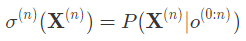
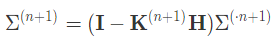

 在隐马尔可夫模型中，一般的假设是状态和观测都是离散的随机变量。如果假定隐藏的状态变量满足连续分布，那么得到的就是线性动态系统。多出现在信号处理与控制论中 。

 假设一个传感器被用于测量未知的物理量 $z$，但测量结果 $x$ 会受到零均值高斯噪声的影响。 

> 如果变量 $z$ 具有慢变的特性，也就是它的波动周期远远大于测量周期，那么不同时刻的测量结果中的差别几乎全部来源于随机噪声，变量本身并不会出现多少波动。这时就可以将平滑窗口的长度（用于求平均的测量结果的数目）取得大一些，以取得更好的抑制随机噪声的效果。
>
> 反过来，如果变量本身是快速变化的，这时就要适当地调小平滑窗口，同时给相距较近的测量结果赋予更大的平滑权重。

 在此基础上对最优的平滑参数进行定量计算的话，就需要对系统的时间演化和测量过程进行概率建模，其模型就是**线性动态系统**。 

##  **线性动态系统也是一种动态贝叶斯网络** 

 **线性动态系统也是一种动态贝叶斯网络，其中的显式变量和隐藏变量都是连续变量，它们之间的依赖关系则是线性高斯的条件分布**。 

 最典型的线性动态系统是用于描述一个或一组高斯噪声影响下的变量随时间变化的过程，可以用以下的条件概率表示： 

>  其中 $\bf X$ 是 $n$ 维的隐藏状态变量，
>
> $\bf O$ 是 $m$ 维的观测变量，
>
> $\bf A$ 是定义了模型的线性转化规则的  $n$ 维方阵，
>
> $\bf Q$ 是定义了状态随时间演化过程中的高斯噪声的 $n$ 维方阵，
>
> $\bf H$ 是定义了从状态到观测的线性转化规则的  $n \times m$ 维矩阵，
>
> $\bf R$ 是定义了观测结果中高斯噪声的 $m$ 维方阵。

隐藏状态变量初始的取值 ${\bf  X}^{(0)}$ 也满足高斯分布。 

 线性动态系统放在状态空间表示（state space representation） ：

 其中 w,v,u 都是均值为 0 的高斯分布。 

## 高斯混合模型扩展

 对原始的线性动态系统模型的一种扩展方式是将系统中的初始状态 ${\bf X}^{(0)}$ 从单个的高斯分布改写为高斯混合模型。

如果高斯混合模型中包含 $K$ 个成分，那么后面所有状态也会是多个高斯分布的混合，通过求解边界概率依然可以对模型进行概率推断。 

## 问题出现

 如果观测概率是 $K$ 个高斯分布的混合，那么初始状态 ${\bf X}^{(0)}$ 的后验概率同样是 $K$  个高斯分布的混合。

随着时序的推进，**后验概率的表示会变的越来越复杂**。在时刻 $n$，状态 ${\bf X}^{(n)}$ 的后验概率数目可以达到  $K ^ n$ 个，这时**参数的指数式增长就会削弱模型的实用性**。 

##  滤波问题（filtering） 

-  如果要根据**截至目前的观测结果**来估计隐藏变量，这样的问题就是**滤波问题**（filtering）；
- 如果要根据一串**完整的观测序列**来估计隐藏变量，这样的问题就是**平滑问题**（smoothing）。

**滤波和平滑**对隐变量的估计都属于概率图模型推断任务的范畴，在离散的隐马尔可夫模型和连续的线性动态系统中都可以实现。 

-  一个只适用于离散模型的运算是**译码（decoding）**，其任务是根据观测序列找到后验概率最大的隐变量序列。 

## **线性卡尔曼滤波器**

 在离散的时间序列上分析连续分布的状态和观测结果的话，需要使用线性**卡尔曼滤波器**这个数学工具。

**线性卡尔曼滤波器**（linear Kalman  filter）的作用是**根据一串包含统计噪声和干扰的观测结果**来计算出单一的、但是更加精确的**估计**。

### 置信状态

在某个时间点上，给定截止目前所获得的所有证据，可以计算出关于系统的当前状态的置信状态（belief state），其中包含了最大的信息量。在离散的时序上，时刻 $n$ 的置信状态可以定义为 :

 其中 ${\bf X}^{(n)}$ 表示当前的状态，$o^{(0: n-1)}$ 表示之前所有的观测。

在**线性高斯**的依赖关系下，**置信状态服从高斯分布**，因而可以用参数有限的均值向量和协方差矩阵来表示，具有紧凑的形式。 

###  **置信状态的均值和协方差更新** 

 **卡尔曼滤波器的作用就是对置信状态的均值和协方差进行更新**，更新的过程可以分成两个步骤 :

1.  根据目前所有可用的观测计算出**隐藏状态变量的置信**，这个置信叫作**先验置信状态**（prior belief state）:

>  式子中上标的 $\cdot$ 是先验置信状态的标志。 

2.  在这个先验置信状态的条件下要**考虑最近的观测结果**，根据推测出的先验置信状态和当前的观测结果共同确定当前的置信状态:

 递归过滤的过程对随时间变化的置信状态进行动态更新，可以看成是递归贝叶斯估计在多元高斯分布中的应用。

### 递归贝叶斯估计

**递归贝叶斯估计**（recursive Bayesian estimation）通过**对不同时间观测值的递归使用来估计未知的概率分布**，是隐马尔可夫模型中常用的推理方法。

线性卡尔曼滤波器就是递归贝叶斯估计在**连续分布**的状态变量上的推广。 

### 状态转移更新

 在卡尔曼滤波过程中，先验**置信状态的更新**由**状态转移更新**（state transition  update）来表示。

> 以上面的线性系统为例:
>
> - 先验置信状态的新均值 $\mu^{\cdot t+1}$ 是将状态转移的线性变换 $\bf A$ 应用在上个时间点的均值 $\mu^{\cdot t}$ 上，
> - 新的协方差矩阵 $\Sigma^{\cdot t+1}$  也是将状态转移的线性变换 $\bf A$ 应用在上个时间点的协方差 $\Sigma^{\cdot t}$ 上，再加上噪声的协方差 $\bf  Q$。

一个变换就可以将状态更新全部概括。 

###  置信状态的**观测更新** 

####  

#### 置信状态的均值

置信状态的均值可以表示为先验置信的均值加上来源于观测结果的修正项，这个修正项是观测残差（observation residual）.

> 观测残差是**期望观测值**和**实际观测值**之差的加权，加权系数是被称为卡尔曼增益（Kalman gain）的系数矩阵 $\bf K$。 

####  

#### 置信状态的协方差

置信状态的协方差也是对先验置信的协方差进行修正，修正的方式是**减去卡尔曼增益加权后的期望协方差**。 

####  **卡尔曼增益** 

 **卡尔曼增益是卡尔曼滤波器中的核心参数，它体现的是观测的重要性**。

> 当表示测量误差的协方差矩阵 $\bf R$  趋近于 0 时，卡尔曼增益会收敛到"状态 - 观测矩阵"的逆 ${\bf  H}^{-1}$.即，**真实的观测结果**在置信状态的更新中**越发重要**，**预测的观测结果**的地位不断下降。
>
> 置信状态在更新后，其协方差趋近于 0，表示当前的状态几乎是确定的。 

 当先验置信的协方差矩阵 $\Sigma^{(\cdot n+1)}$ 趋近于 0 时，计算出的卡尔曼增益也会趋近于  0。

> 这种情况下，在置信更新中占据**主导**地位的就变成了对分布的**预测结果**，观测结果影响不大。
>
> 随着时序的推移，置信状态最终会收敛到某个分布上，系统的不确定性也会呈现出**稳定的状态**。 

### 其他变体模型

>  **扩展卡尔曼滤波器**（extended Kalman filter） ：
>
>  用泰勒展开中的一阶导数和二阶导数进行局部的线性化处理 
>
>  **无迹卡尔曼滤波器**（unscented Kalman filter） ：
>
>  通过无迹变换来对非线性动态进行线性化 

 无论是扩展卡尔曼还是无迹卡尔曼 ， 都是对非线性特性的**确定性近似（**deterministic approximation）。它们放弃了精确计算的追求，转而以确定的方式**求解近似的结果**。 

### 粒子滤波

 如果用**随机的方式**来对非线性特性做出近似，对应的方法就是**粒子滤波**（particle filter） 

 它并不通过复杂的积分计算出准确的结果，而是**对总体的分布进行采样**，用**样本的经验分布来代替总体的真实分布**，用样本的均值来代替总体的积分运算。 

>  由于这种方法和蒙特卡洛采样的思路近似，因而也被称为序贯蒙特卡洛（sequential Monte Carlo）。

作为一种非参数方法，粒子滤波可以用来建模任意形式的概率分布，虽然效果未必有多好，很多情况下却是唯一可行的方法。 

#### 过程简述

 粒子滤波用样本的平均值来代替总体分布的数学期望，平均值指加权平均，**样本及其权重共同构成了粒子滤波中的“粒子”**。

整个粒子滤波的过程就是**动态调整样本的权重**，使经验分布不断接近真实分布的过程 

## 总结

- 线性动态系统是具有连续状态变量的隐马尔可夫模型，所有条件概率都是线性高斯分布；
- 线性动态系统的求解是根据先验置信状态和观测结果来更新系统的置信状态；
- 卡尔曼滤波器可以对线性动态系统进行精确求解；
- 当系统具有非线性和非高斯特性时，可以通过扩展卡尔曼滤波器、无迹卡尔曼滤波器和粒子滤波等方法求解。

卡尔曼滤波器及其变种在动态的运动目标跟踪中有广泛的应用，是机器人感知、定位与导航的一种重要方法。

