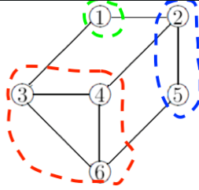
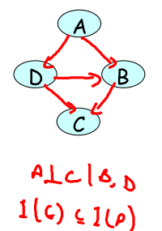

 在实际当中，条件独立性几乎是不可能满足的，属性之间总会有些概率性的关联，如果将属性之间的关联体现在概率图模型中，就相当于把朴素贝叶斯中互相独立的结点联结起来（然后会加入条件独立假设简化计算），得到的正是**贝叶斯网络**。 

# **贝叶斯网络**

 **贝叶斯网络**（Bayesian network）也叫**信念网络**（belief network），由一些顶点和连接某些顶点的边构成，每个顶点代表一个随机变量，带箭头的有向边则表示随机变量之间的因果关系。 

 **从拓扑结构看，贝叶斯网络是有向无环图** 。


 贝叶斯网络是对随机变量以及存在于它们之间的不确定性的一种表示（representation），它以因子分解的方式定义了联合概率分布的数据结构，还给出了这个分布中的**一系列条件独立性假设**（事件之间的因果关系不能完全确定）。 


 当事件之间的因果关系不能完全确定时，基于概率的贝叶斯网络是如何发挥作用的？

1.  所有的因果联系都不是绝对的 。
2.  从结构上看，条件独立性在一定程度上简化了随机变量的关系，**在给定父结点的条件下**，每个结点都和它的**所有非后代结点**条件独立。 
3.  从结构上看，**父结点、子结点以及子结点的后代结点**共同形成一条逻辑关系上的通路，概率的变化就是在这条通路上**传导**。如果其他结点不在这条通路上，就大概率不会受到处在通路上的结点的影响。 


## 计算

 要对贝叶斯网络进行定量计算，就需要给**每个根结点**所表示的**随机变量赋予概率值**，同时给表示不同结点之间依赖关系的**每条有向边**所代表的所有**条件概率赋值**。 

 结构上的**条件独立性降低了贝叶斯网络所需要求解的概率的数目**，从而在根本上降低推断的计算成本。 


## 独立性

**贝叶斯网络可以视为一个条件独立性的大集合**。 

顺连（linear）、分连（diverging）、汇连（converging） 这三种基本结构都隐含着各自的条件独立性，它们的组合又可以形成更加复杂的连接方式，构成新的条件独立关系。 

>  在给定一些证据（evidence），也就是某些结点的取值固定时，如果一个结点的变化会影响到另一个结点的变化，那它们就是 $d$  连通的（$d$-connected），它们之间存在着 $d$ 连接路径（$d$-connecting path）。
>
> 反过来，不存在 $d$  连接路径的两个结点就是 $d$ 分离的（$d$-separation）。 


###  **$d$ 连通**

 那么如何判定在给定证据集时，两个结点是否是 **$d$ 连通**的呢？这需要让两结点之间的所有结点都满足以下两个条件中的任意一个： 

- 以顺连或者分连的形式连接，且不属于证据集（给定证据不是中间节点或者共父节点）
- 以汇连形式连接，且结点本身或者其子结点属于证据集（给定证据不是汇聚节点，共同指向节点）


### $d$ 分离

 $d$ 分离性（与$d$ 连通相反）是条件独立性的充分必要条件，它既具备可靠性（soundness）也具备完备性（completeness）。

> 如果两个结点是 $d$ 分离的，那它们就肯定满足条件独立；反过来如果两个结点条件独立，两者之间也必定不会存在 $d$ 连接路径。 


### **马尔可夫毯**（求解概率的所需变量范围）

 由 $d$ 分离性可以引出**马尔可夫毯**（Markov blanket）的概念。

将所有结点分成互斥的若干个子集，如果在**给定集合 $X$** 的条件下，集合 $A$ 中的任何变量都和集合 $B$ **条件独立**，那么满足这一条件的**最小集合 $X$** 就是集合 $A$ 的**马尔可夫毯**。 


 一个结点的马尔可夫毯包括它的父**结点、子结点和共父结点**，也就是子结点的其他父结点。马尔可夫毯包含了所有关于集合中变量的信息，非马尔可夫毯中的变量在描述 $A$ 时都是冗余的。

如果要计算 $A$ 中变量的概率，就不需要惊动所有变量，只需要对马尔可夫毯进行处理就可以了。

 

###  I-map

 从图结构的角度分析贝叶斯网络的话，还可以定义出独立图的概念。

**独立图**（Independency map, I-map）是对概率分布进行拆解的产物。

> 如果概率分布 $P$ 中所有的**条件独立性**都能够在有向无环的图结构 **$\mathscr G$ 中表示**出来，那么 $\mathscr G$ 就是 $P$ 的独立图。 
>
> If P factorizes over a graph G, we can read from the graph independencies that must hold in P (an independency map)
>
> 对于图：
>
> 
>
> 任何 P 都可以factorizes 没有 independency 关系图G。


 所谓贝叶斯网络其实就是由 $({\mathscr G}, P)$ 构成的，其中概率分布 $P$ 可以**根据图 $\mathscr G$ 进行因子分解**，图 $\mathscr G$ 是分布 **$P$ 分解得到的独立图**。 

> 将属性X和类别Y的**联合分布**表示成一个**关于类的先验**分布（prior distribution）和一组关于属性的条件概率分布（conditional probability distribution）的乘积，这个过程被称为**因子分解** （factorization）
>
> $ p(Y,X)=p(Y)⋅∏ _{i=1}p(Xi|Y) $


##  pgmpy 

 Python 语言中实现概率图模型的话，可以使用第三方库 pgmpy，这是由《利用 Python 掌握概率图模型》（Mastering  Probabilistic Graphical Models using Python）的作者安库尔·安坎（Ankur  Ankan）所开发并维护的。 

 在使用中，建模贝叶斯网络需要用到 models 模块的 BayesianModel 类，定义离散的条件概率需要用到 factors.discrete 模块的 TabularCPD 类 。

```python
from pgmpy.models import BayesianModel
from pgmpy.factors.discrete import TabularCPD
from pgmpy.inference import VariableElimination

model = BayesianModel()
model.add_nodes_from(['family_out', 'bowel_problem',
                      'light_on', 'dog_out', 'hear_bark'])
model.add_edge('family_out', 'light_on')
model.add_edge('family_out', 'dog_out')
model.add_edge('bowel_problem', 'dog_out')
model.add_edge('dog_out', 'hear_bark')

cpd_fo = TabularCPD(variable='family_out', variable_card=2,
                    values=[[0.15], [0.85]])
cpd_bp = TabularCPD(variable='bowel_problem',
                    variable_card=2, values=[[0.01], [0.99]])
cpd_do = TabularCPD(variable='dog_out', variable_card=2,
                    values=[[0.99, 0.9, 0.97, 0.3], [0.01, 0.1, 0.03, 0.7]],
                    evidence=['family_out', 'bowel_problem'], evidence_card=[2, 2])
cpd_lo = TabularCPD(variable='light_on', variable_card=2,
                    values=[[0.6, 0.05], [0.4, 0.95]], evidence=['family_out'], evidence_card=[2])
cpd_hb = TabularCPD(variable='hear_bark', variable_card=2,
                    values=[[0.7, 0.01], [0.3, 0.99]], evidence=['dog_out'], evidence_card=[2])

model.add_cpds(cpd_fo, cpd_bp, cpd_do, cpd_lo, cpd_hb)
# model justification
model.check_model()

infer = VariableElimination(model)
print(infer.query(['family_out'], evidence={
      'light_on': 0, 'hear_bark': 1})['family_out'])

```


## 总结

- 贝叶斯网络是有向无环图，可以用于因果推断；
- 贝叶斯网络既是具有条件独立性的随机变量的联合分布，也是联合概率分布的因子分解结果；
- 贝叶斯网络中的条件独立性可以通过 $d$ 连通路径和 $d$ 隔离性描述；
- 贝叶斯网络的概率分布描述和独立图描述可以相互转换。

目前，贝叶斯网络及其推断在医疗诊断中已经得到了广泛的应用。


# 马尔可夫随机场

 贝叶斯网络将随机变量之间的条件独立性与依赖关系嵌入到图结构之中，既有助于直观表示，又能简化计算。但这并不意味着贝叶斯网络可以通吃所有概率关系。

>   “四个学生 Alice、Bob、Charles 和 Debbie 在一个学习小组中，但由于 A 和 C、B 和 D 两两之间因为感情的纠葛导致没有交流，因此每个人可以交流的对象都只有 2 个。这样的关系应该如何表示呢？” 
>
> 
>
> 都不对
>
> 
>
>  每一个结点只与和它相邻的两个结点相关，和其他结点全部条件独立。这其实是将顺连结构的首尾扣在了一起，可就是这么简单的操作，无环图的贝叶斯网络却无计可施。环状结构中其实不存在方向的概念，不管是顺时针还是逆时针的流动都能够回到原点。


##  **马尔可夫网络** 

 将贝叶斯网络中边的方向去掉，得到的就是马尔可夫随机场。**马尔可夫随机场**（Markov random field）又叫**马尔可夫网络**（Markov network） 。

 **连接顶点的边没有方向，图中也可以存在环路结构**。 


## 与贝叶斯网络的差别

 和贝叶斯网络相比，马尔可夫随机场侧重于表示随机变量之间的相互作用：虽然它**不能进行因果的推理**，却可以对循环**依赖关系**建模。 

**无向的马尔可夫随机场实际上建模了所有变量的联合分布，这就和贝叶斯网络对条件分布的建模形成了对比**


##  参数化（parameterization） 

 由于马尔可夫随机场中的变量之间的相互作用不再是明确的条件依赖关系，贝叶斯网络中的条件概率分布也就不再适用了。

在参数化的过程中，马尔可夫随机场着重刻画**变量之间的连接关系**，并由此引入了**因子**（factor）的概念。 

>  因子也叫**势函数**（potential  function），是定义在结点所表示的变量子集上的非负函数，随机变量每一组可能的取值都对应着一个因子值。
>
> 如果两个随机变量在某个特定取值上的**因子越大**，说明这两个随机变量在这一组取值上的**兼容性越好**，也就意味着这一组取值**同时出现的可能性比较大**。 


## **因子**（factor）

 所有因子都有相同的作用，那就是定量描述直接关联的随机变量的**关联性**。 

 将所有局部上的因子组合起来，得到的就是马尔可夫随机场整体的分布。和贝叶斯网络一样，局部因子也是通过**相乘的方式**加以结合，形成所有随机变量的**联合概率分布**。但由于对因子直接计算的结果**不等于 1**，所以还需要额外的**归一化**过程。

从因子函数到概率分布的数学表达式可以写成 ：


 归一化常数被称为**配分函数**（**partition function**），它的取值等于所有因子关于不同取值的和。

>  计算：
>
> 
>
>  计算四个随机变量分别等于 $a^0, b^0, c^1, d^1$ 的概率，就需要先将反映它们之间的依赖关系的因子相乘 ：
>
> 
>
> **NOTE**:  在两个因子相乘时，将这两个因子联系起来的中间变量的取值必须是匹配的 
>
>  对于 4 个二值变量来说，所有取值的组合共有 16 种。计算出所有 16 个值后再进行归一化。

 

因子的概念不仅适用于单个随机变量，也适用于随机变量的集合。如果不做归一化的话，按照上面的方法所计算出的 $\phi_1(a, b) \cdot  \phi_2(b, c) \cdot \phi_3(c, d) \cdot \phi_4(d, a)$ 实际上就是 ABCD  这四个变量整体的因子$\phi(a, b，c，d)$。 

> 因子与条件概率：
>
>  虽然因子在形式上看起来和条件概率很像，但两者的意义是不同的，这种不同也会体现在数值上。**每个因子都是联合分布的一部分，因子之间也会产生相互作用，只有对因子之间的相互作用进行边际化处理之后，得到的才是真正的条件概率**。 

 

可以看出，**无向的马尔可夫随机场实际上建模了所有变量的联合分布，这就和贝叶斯网络对条件分布的建模形成了对比**。 


## 吉布斯分布与**玻尔兹曼分布** 

 如果把单个因子视为概率，那么前文中因子的归一化所形成的概率分布就是**吉布斯分布**（Gibbs distribution）。

如果把吉布斯分布中的所有因子都改写成指数函数的形式，它就又变成了**玻尔兹曼分布**（Boltzmann distribution）。

> 在统计力学中，玻尔兹曼分布可以用于描述**系统的能量分布** 


马尔可夫随机场和吉布斯分布是等价的，其等价性由**哈默斯利 - 克利福德定理**（Hammersley-Clifford theorem）所保证。 


最主要的一点是**只有当非负的概率分布可以进行因子分解时，它才能和无向的图结构等价**。

**可以进行因子分解的概率分布是吉布斯分布，其等价的图结构就是马尔可夫随机场**。

> **因子分解** （factorization） 
>
> $ p(Y,X)=p(Y)⋅∏ _{i=1}p(Xi|Y) $


##  马尔可夫随机场因子分解

 目标是将原始的图结构整合成若干个团。

> 团（clique）是由结点的组合形成的全连接结构，团中的**任意两个结点之间都存在互相连接**的边。


如果在已有的团中加入任何一个多余的结点都不能成团的话，这样的团就是**极大团**（maximal clique），**极大团和吉布斯分布的关系**可以类比为**贝叶斯网络中的独立图和概率分布**的关系。 



​																		 极大团 


##  马尔可夫随机场条件独立关系 （ **马尔可夫性** ）

 如果两组结点 $X$ 和 $Y$ 通过第三组结点 $Z$ 相连接，$X$ 中的任意一个结点到 $Y$ 中的任意一个结点的路径都要经过 $Z$  中的结点，而**不存在绕过点集 $Z$ 的通路的话**，那就可以说 $X$ 和 $Y$ 被 $Z$ 所分离，$Z$ 是 $X$ 和 $Y$  的分离集（**separation set**）。 


 马尔可夫性也被分为以下三种形式 ：

1. **全局马尔可夫性**（global Markovianity）：给定两个变量子集的分离集**separation set**，则这两个变量子集条件独立。
2. **局部马尔可夫性**（local Markovianity）：给定一个变量子集的**邻接变量**，则这个变量和其他所有变量条件独立，也就是**邻接变量**构成了此变量和其他变量的**分离集**。
3. **成对马尔可夫性**（pairwise Markovianity）：给定**其他所有变量**，则**剩下的两个非邻接变量**条件独立，也就是其他所有变量共同构成非邻接变量的分离集。


##  pgmpy 

 马尔可夫随机场的核心是因子，建模马尔可夫随机场需要用到 models 模块的 MarkovModel 类，因子的定义则需要通过调用  factors.discrete 模块的 DiscreteFactor 类来实现。构造出模型后可以计算配分函数，进而计算所有随机变量的联合分布。 

```python
from pgmpy.models import MarkovModel
from pgmpy.factors.discrete import DiscreteFactor
from pgmpy.inference import VariableElimination

phi_1 = DiscreteFactor(['A', 'B'], [2, 2], [30, 5, 1, 10])
phi_2 = DiscreteFactor(['B', 'C'], [2, 2], [100, 1, 1, 100])
phi_3 = DiscreteFactor(['C', 'D'], [2, 2], [1, 100, 100, 1])
phi_4 = DiscreteFactor(['D', 'A'], [2, 2], [100, 1, 1, 100])

model = MarkovModel([('A', 'B'), ('B', 'C'), ('C', 'D'), ('D', 'A')])
model.add_factors(phi_1, phi_2, phi_3, phi_4)
phi = phi_1 * phi_2 * phi_3 * phi_4
Z = model.get_partition_function()
normalized = phi.values / Z

print(normalized)
```


## 总结

- 马尔可夫随机场是无向图，可以用于建模变量之间的相互作用；
- 马尔可夫随机场与可以进行因子分解的吉布斯分布等价；
- 马尔可夫随机场中的条件独立性可以分为全局性、局部性和成对性；
- 马尔可夫随机场和贝叶斯网络可以相互转化。

虽然不能用于因果推断，但马尔可夫随机场在图像处理中有着非常广泛的应用，图像分割、去噪、目标识别等计算机视觉任务中都能见到马尔可夫随机场的身影。


# 贝叶斯网络和马尔可夫随机场相互转化

 贝叶斯网络和马尔可夫随机场虽然结构不同，但都是对概率分布的参数化和对条件独立性的表示，因而可以相互转化。

### 贝叶斯网络变成马尔可夫随机场

将贝叶斯网络变成马尔可夫随机场较为简单，只需要将所有边的方向全部去掉，同时在汇连结构的两个共父结点结点之间添加无向边，这个过程被称为**端正化**（moralization），得到的结果就是**端正图**（moral graph）。 


### 马尔可夫随机场转化成贝叶斯网络

 将马尔可夫随机场转化成贝叶斯网络就没那么容易了。这其中最关键的问题在于因果关系的确定，也就是有向边到底由谁指向谁，不同的指向会导致不同的条件独立性。

不仅要给已有的边添加方向，还要给原始马尔可夫随机场中的环结构添加额外的边来形成弦图（chordal graph），这个过程被称为**三角化**（triangulation）。 





