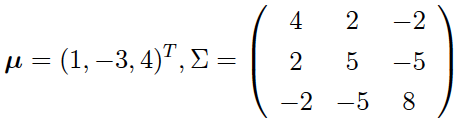

 无论是贝叶斯网络还是马尔可夫随机场，定义的变量都服从取值有限的离散分布，变量之间的关联则可以用有限维度的矩阵来表示。

如果将**随机变量的范围从离散型扩展到连续型**，变量的可能取值就有无穷多个，这时变量之间的依赖关系就不能再用表格的形式来表示了，需要重新定义概率图模型中的相互作用与条件独立性。 


# 高斯网络

 最简单的情形，结点所表示的随机变量都服从高斯分布，**由高斯型连续随机变量构成的概率图模型统称为高斯网络**（Gaussian network）。 

如果多个服从一维高斯分布的随机变量构成一个整体，那它们的联合分布就是**多元高斯分布**（multivariate Gaussian distribution），其数学表达式可以写成

$ p({\bf x}) = \dfrac{1}{(2\pi)^{n / 2} | \Sigma |^{1/2}} \exp [-\dfrac{1}{2} ({\bf x} - \boldsymbol \mu)^ T  \Sigma^{-1} ({\bf x} - \boldsymbol \mu)] $

 其中 $\boldsymbol \mu$ 是这组随机变量的均值向量（mean vector），$\Sigma$ 是这组随机变量的协方差矩阵（covariance matrix），$| \Sigma |$ 是它的行列式值。 

> 协方差矩阵是对称的正定（positive  definite）矩阵，表示了不同变量之间的关联
>
> - 如果两个变量**线性无关**，那么其协方差矩阵中对应的**元素就等于  0**，这意味着两个变量满足边际独立性（**marginal independency**，边际分布独立）
> - 如果所有变量**都线性无关**的话，协方差矩阵就退化为**对角矩阵**。 


## 条件独立 （conditional independency） 

协方差矩阵的逆矩阵 $J = \Sigma ^ {-1}$ 被称为**信息矩阵**（information matrix），**信息矩阵**和**均值向量**的乘积则被称为**势向量**（potential vector）（$J^T{\bf x}$） 。

 和边际独立性不同，**条件独立性**不能直接在协方差矩阵中体现出来，必须通**过信息矩阵加以观察**。 


信息矩阵的元素等于 0 说明对应的两个变量**在给定其他变量的前提下条件独立**，比如 $J_{1,3} = 0$ 就意味着着在其他变量固定时，$x_1$ 和 $x_3$ **条件独立**。


###  **高斯线性模型**（linear Gaussian model） 

**高斯线性模型**（linear Gaussian model）指的是一个随机变量可以表示为一组随机变量的线性组合，这个随机变量本身的不确定性则可以用高斯分布来建模，这种关系写成数学表达式就是

 $y = \beta_0 + \beta_1 x_1 + \cdots + \beta_k x_k + \epsilon,  \epsilon ~{} {\mathscr N}(0, \sigma ^ 2) $

 和原始线性回归的假设是完全一致。

>  把这种关系放到概率图模型中，那么所有的 $x_i$ 都可以看成结点 $y$  的父结点，它们一起构成了**汇连结构**。
>
> 从概率角度看，给定这些父结点后，子结点 $y$ 的条件概率就服从高斯分布，其均值是 $x_i$  的线性组合，方差则是噪声 $\epsilon$ 的方差。 


如果这些自变量$x_i$ 都是随机变量，共同服从均值为 $\boldsymbol \mu$，协方差矩阵为  $\Sigma$ 的多维高斯分布。

那么可以证明随机变量 $y$ 也是高斯随机变量，它的均值等于 $\beta_0 + \boldsymbol \beta^T \boldsymbol \mu$，方差等于 $\sigma ^ 2 + \boldsymbol \beta^T \Sigma  \boldsymbol \beta$，变量 $X_i$ 的协方差则等于 $\sum_{j = 1}^k  \beta_j\Sigma_{i,j}$。


这样的结论告诉我们，**高斯线性模型实际上定义了一个高斯贝叶斯网络**（Gaussian Bayesian network），**整个概率图所表示的联合分布就是一个多维高斯分布**。


> 求解简单示例：
>
> **问题**：如果一个线性高斯网络具有顺连结构 $X_1 \rightarrow X_2 \rightarrow X_3$，其中 $X_1$  的概率密度 ${\mathscr N}(1, 4)$，已知 $X_1$ 时 $X_2$ 的条件概率密度为 ${\mathscr  N}(0.5X_1 - 3.5, 4)$，已知 $X_2$ 时 $X_3$ 的条件概率密度为 ${\mathscr N}(-X_2 + 1,  3)$，试求解整个网络所表示的联合分布。
>
> **求解**：
>
> 1. 高斯形式已经确定，求解联合分布实际上就是求解所有变量的**均值向量**和**协方差矩阵**。
> 2. 由于 $X_2$ 等于 $0.5X_1 -  3.5$，将 $X_1$ 的均值为 1 代入，求出 $X_2$ 的均值等于 $0.5 \times 1 - 3.5 =  -3$，同理可以求出 $X_2$ 的均值等于 $-(-3) + 1 = 4$。
> 3. 协方差：协方差矩阵的对称性，需要确定 6 个元素。
>    1. $X_1$ 的方差  $\Sigma_{11} = 4$ 是已知
>    2. $\Sigma_{22} = 0.5^2 \times 4 + 4 = 5$ 
>    3. $\Sigma_{33} = (-1)^2 \times 5 + 3 =  8$（这三个方差定义了变量自身的不确定性，是协方差矩阵中的对角线元素）
>    4. 下一步就是确定非对角线上的元素：
>       1. 由于 $X_2$ 这个变量只取决于  $X_1$，其关联的强度由线性系数确定， $\Sigma_{12} = 0.5  \times \Sigma_{11} = 2$(含义在于用 $X_1$ 的变化对 $X_2$ 的变化的影响)
>       2. 同理，$X_2$ 和 $X_3$ 之间的协方差为 $\Sigma_{23} = -1 \times \Sigma_{22} = -5$。
>       3. $X_1$ 和 $X_3$ 之间并不存在直接的作用，而是以 $X_2$ 作为媒介和中转。 $\Sigma_{13} = \Sigma_{12} \cdot (-1) =  -2$
>       4. 

这些变量两两之间都不是边际独立的。但当  $X_2$ 确定时，$X_1$ 和 $X_3$  **条件独立**，所以它的信息矩阵中会有**两个零元素**（这说明在图结构中，表示同一个联合分布只需要**更少的参数**）。


图结构的优势也可能变成劣势。

> 汇连结构 $X_1 \rightarrow X_2 \leftarrow  X_3$，由于汇连结构中不存在条件独立的结点，因此联合分布的信息矩阵中所有元素都是非零的。
>
> 但由于 $X_1$ 和 $X_3$  互不影响，因此**协方差矩阵**中反倒存在着零元素。

> 在此基础上，如果再给结点 $X_1$ 和 $X_3$ 赋予一个**共同的父结点** $X_4$，让这三者形成分连结构。
>
> 那整个网络中就既没有条件独立性，也没有边际独立性，无论是协方差矩阵还是信息矩阵中就都不会出现非零元素了。


## 高斯马尔可夫随机场（Gaussian Markov random field）

**将多元高斯分布嵌入到无向的马尔可夫随机场中，得到的就是高斯马尔可夫随机场**（Gaussian Markov random field）。

在处理高斯随机场时，先要对多元高斯分布的**概率密度**做些处理，将指数项中的协方差逆矩阵 $\Sigma ^ {-1}$ 替换为信息矩阵 $J$ 并展开。

由于均值向量和信息矩阵都是常量，将它们去掉就可以得到概率密度的正比关系

 $p({\bf s}) \propto \exp [-\dfrac{1}{2} {\bf x}^T J {\bf x} + (J \boldsymbol \mu)^T {\bf x}] $

这个式子被称为**高斯分布的信息形式**（information form）。

展开后，包含两种多项式成分：

- 一种成分是单个变量 $X_i$ 的函数，其表达式可以写成 $-J_{i, i}x_i^2 / 2 + h_ix_i$（来自$-\dfrac{1}{2} {\bf x}^T J {\bf x}$和$(J \boldsymbol \mu)^T {\bf x}$），其中 $h_i$ 是势向量的第 $i$ 个分量:
  - $J^T{\bf x}$为**势向量**（potential vector）
  - 看成每个**结点的势函数**（node  potential）
  - **结点的势函数**只存在于具有成对马尔可夫性的网络之中
- 另一种成分是两个变量 $X_i$ 和 $X_j$  乘积的函数，其表达式可以写成 $-J_{i, j}x_ix_j$（来自$-\dfrac{1}{2} {\bf x}^T J {\bf x}$）
  - 看成连接这两个结点的**边的势函数**（edge potential）
  - 元素  $J_{i, j} = 0$，其对应的边势也等于 0，就说明这两个结点之间**没有连接的边**


> 下图是一个典型的**成对马尔可夫随机场**，每个结点都和它所有的非邻接结点条件独立，在信息矩阵 $J$ 中，这些条件独立的结点组合所对应的元素就等于 0。
>
> 
>
> 


## 多元高斯分布与成对马尔可夫随机场

 **多元高斯分布定义的是成对的马尔可夫随机场**，其中的每个势函数都具有**二次型**的形式。

> 由于**任何合法的高斯分布都具有正定的信息矩阵**。
>
> 所以如果一个**成对随机场**能够改写成多元高斯分布，那**成对随机场**的势函数的**系数**所形成的矩阵也必须得满足**正定**的条件。 


 对连续分布的建模能够大大拓展概率图模型的应用范围 ， **虽然高斯分布并不适用于所有的连续变量，但良好的数学性质和便于计算的特点让它成为了理想条件下近似建模的首选**。 


##  **混合网络**（hybrid network） 

 如果一个概率图模型中的随机变量既有离散型也有连续型，这样的网络就是**混合网络**（hybrid network）。

一个问题是同一个结点的父结点可能存在**不同的类型**，其中既有连续分布的结点，也有离散分布的结点。

而在处理这些父结点不同的子结点时：

1.  如果子结点是连续分布的结点，相对简单。
   - 由于离散分布的父结点取值的组合是有限的，对每一种可能的取值都为子结点定义一组线性系数，将离散结点的信息编码到这组线性系数当中。 
   -  子结点表示成连续父结点的线性组合 
   -  线性系数则由离散父结点来决定 ， 这种模型被称为**条件线性模型**（conditional linear model），它本质上是一组**不同参数的高斯分布**所形成的**混合模型**（mixture model） 
2.  当一个离散的子结点具有连续的父结点时：
   -  最简单的办法是采用**阈值模型**（threshold model），当连续变量的取值大于阈值时输出 1，小于阈值时输出 0。
   - 逻辑回归或者 softmax 回归的思想，计算离散的子结点关于连续的父结点的条件概率，并输出条件概率最大的结果。 


## 总结

- 高斯网络采用高斯线性模型建模连续变量，其数字特征为均值向量和协方差矩阵；
- 高斯贝叶斯网络利用多元高斯分布生成独立图，利用信息矩阵计算网络中的条件概率；
- 高斯马尔可夫随机场具有成对马尔可夫性，通过高斯分布可以确定结点势和边势；
- 混合网络是同时具有离散型结点和连续型结点的概率图模型。


# 高斯过程 

 如果像傅里叶变换（Fourier transform）那样，将无数个服从不同高斯概率分布的随机变量叠加到一起，这个在向量空间上形成的高斯分布就变成了**函数空间上的高斯过程**。 


 **高斯过程**（Gaussian process）是由出现在连续域（时间或空间都行）上的无穷多个随机变量所组成的随机过程，无穷维向量的变换可以看成是个函数（function）。

**高斯性**（Gaussianity）指的是这无穷多个随机变量联合，共同服从无穷维高斯分布。

> 如果从中取出一部分变量，这些变量的**边际分布**也是高斯形式的。 


## **高斯过程**（Gaussian process）的解释

 假设 $y({\bf x})$ 是个高斯过程。

### 空间

从空间尺度上看，如果在定义域中任取出一些点 ${\bf x}_1, {\bf x}_2,  \cdots, {\bf  x}_N$，那么这些点的联合分布就是多元的高斯分布。对于定义域上的任何子集都成立。


### 时间

从时间尺度上看，即使每次都抽取相同的点，**随机过程的特性决定了样本每次独立的实现都会有所差异**。但是在统计意义上，同一个**自变量在多次抽取中得到的结果**也是**满足高斯分布**的。 


### 数据

 从数据生成的角度看，高斯过程还可以通过线性回归更加直观地理解。

给定线性关系 $y = {\bf w}^T {\bf x}$  之后，对于每一个可能出现的权值向量 $\bf w$，都会有一条直线和它对应。

所有 $\bf w$  所对应的直线布满整个二维空间，而线性回归的就是找到那条和训练数据**匹配度最高**的那条直线。

找到最优的直线意味着**确定后验意义下最优的线性系数**  $\bf w$，因此这个过程归根结底还是个参数化的过程。 


### 参数化过程到非参数化过程

 如果要将上面的参数化过程过渡为完全的非参数化过程，就要摆脱对于参数 $\bf w$ 的依赖。


最直接的方法是**不定义 $\bf w$  的先验**，而是**在函数空间上的输出 $y({\bf x})$ 的先验**（即，$y({\bf x})$取不同函数形式的概率）。

而对函数建模最简单的模型就是**给连续的  $y({\bf x})$ 赋予高斯型的先验分布**，得到的就是**高斯过程**。 

> 每个可能的 $y({\bf x})$  都是从高斯过程中抽取的一个样本。

直接对函数建模的非参数模型拟合能力更强。


> 1. 有限维度的高斯分布：
>
> 有限维度的高斯分布可以用均值向量和协方差矩阵这两个数字特征完全地刻画。
>
> 2. 无穷维的高斯过程：
>
> 均值向量和协方差矩阵变成了**函数的形式**。
>
> 均值函数取决于训练数据 $\bf X$，它体现了样本出现的整体位置，通常被设置为  0（考虑相对位置，而协方差矩阵才是高斯过程的关键）。


## 协方差函数

要理解协方差函数在高斯过程中的作用，首先要明确高斯过程的一个主要特点，那就是它**建模的对象**不是自变量  $\bf x$ 和因变量 $y$ 之间的关系，而是不同的**因变量 $y$ 和 $y’$  之间的关系**，正是这种思想决定了高斯过程的**非参数特性**。

**因变量之间的关系正是通过协方差函数体现**.


假定训练数据集是 $({\bf X}, {\bf  y})$，线性关系中的权重系数为 $\bf w$，那么输出的协方差函数就可以表示成

$ {\rm Cov}({\bf y}) = {\rm E}[{\bf y}{\bf y}^T] = {\bf X}{\rm E}[{\bf w}{\bf w}^T]{\bf X}^T = \dfrac{\bf K}{\alpha} $

其中 $\bf K$ 被称为**格拉姆矩阵**（Gram matrix），其元素为 $K_{ij} =  K({\bf x}_i, {\bf x}_j) = ({\bf x}_i)^T {\bf x}_j$。

​		 $\alpha$ 是**参数** $\bf w$ 所服从的**高斯分布方差的倒数**。

这表示未知函数 **$f(\cdot)$ 在 ${\bf x}_i$ 和 ${\bf x}_j$  两点上的函数值服从二元高斯分布**，其均值可以不失通用性地视为 0， ${\bf x}_i$ 和 ${\bf x}_j$  两点协方差矩阵则是上面求出的 ${\rm Cov}({\bf y})$  中对应行列所形成的 $2 \times 2$ 方阵。


### 核函数

在上述表达式中，如果引入基函数的扩展来定义函数的先验，用**函数 $\phi (\cdot)$ 对输入的自变量做一个特征映射**，那协方差函数的元素就变成了

 $K_{ij} = \phi({\bf x}_i)^T \phi({\bf x}_j) $

显然，这时的协方差函数已经具有了**核函数**的形式。

 当 $K_{ij}$ 取作径向基函数的形式 $\exp (-| {\bf x}_i - {\bf x}_j | ^ 2 / 2)$ 时，它就有了一个新的名字——**平方指数**（squared exponential）。 


## 高斯过程概括

**高斯过程其实就是核技巧在概率模型中的扩展，它将输出的协方差表示成输入的函数**，即

**${\rm Cov}({\bf y})=\dfrac{\bf K}{\alpha}$**

**再通过协方差在某个空间下，来描述数据点之间的关系**，即

$K_{ij} = \phi({\bf x}_i)^T \phi({\bf x}_j) $

在预测新样本时，高斯过程给出的不是对预测结果的点估计，而是完整的概率分布，这是一般的频率主义方法不能比的。


## 参数空间看高斯过程

前面对高斯过程的理解都是从**函数空间**（function space）的角度出发的。

高斯过程也可以从**参数空间**（weight space）的角度来认识，这种理解方式是将高斯过程应用到线性回归的拟合之中，也被称为**高斯过程回归**（Gaussian process regression）。

> 这部分内容实际上就是将上面的分析调转方向，通过定义特征映射将数据在高维空间中表示出来，再**在高维空间上应用贝叶斯的回归分析**。


 结论是：

1. 用高斯过程计算出的预测分布（predictive  distribution）也是一个高斯分布。
2. 均值是后验意义下的最优估计，方差则表示了估计结果的可信范围。
3. 这两个参数都和高斯过程的协方差函数（核函数）有关。使用不同的核函数，估计结果不同。 


## 为什么选择高斯分布作为先验

根据最大熵原理的推导结果。

1.  **当随机变量的协方差矩阵给定时（即，已知观测数据），高斯分布的不确定性是最大的**，这符合机器学习不做出多余假设的思想，未知的东西就让它保持其不确定性。 
2.  另一方面，高斯分布良好的数学特性也让它适用于贝叶斯主义的方法。**对高斯分布进行边际化处理，得到的结果依然是高斯分布**。


##  非参数的局部化模型 

高斯过程和其他局部化的模型有什么区别和联系呢？

####  **核回归**

**核回归**（kernel  regression）就是一种局部化回归模型。

它利用的是核函数的平滑作用，**用核函数对未知数据点附近的已知数据点的输出结果进行加权**，再将加权的**结果作为未知数据点的输出**。

这相当于**将输入空间划分成不同的局部区域**，在每个局部上拟合一个常数 $\theta_0$ 作为输出。 


####  **局部加权回归**（locally weighted regression） 

 每个局部上拟合的目标不是常数，而是一阶的线性模型 $\theta_0 + \theta_1 x$。 


 这些局部化的回归模型就是**核函数 +  $k$ 近邻**方法，其中的核函数并没有统计特性上的意义，只是作为加权系数出现，所以被称为**平滑核**（smoothing kernel）。

平滑核必须满足的是**归一化**的条件，也就是所有权重系数的积分等于 1。

相比之下，来源于协方差矩阵的核函数完全满足正定的条件，是满足条件的**Mercer 核**。

> **Mercer** 定理：任何半正定的函数都可以作为核函数。所谓半正定的函数f(xi,xj)，是指拥有训练数据集合（x1,x2,...xn)，我们定义一个矩阵的元素$a_{ij} = f(x_i,x_j)$，这个矩阵式n*n的，如果这个矩阵是半正定的，那么$f(x_i,x_j)$就称为半正定的函数。这个mercer定理是**核函数必要条件**。
>
> 根据高斯过程的核函数可以计算出对应的平滑系数，计算出来的结果被称为**等价核**（equivalent kernel）。 


##  高斯过程应用于二分类问题 

 常用的处理方法是对高斯过程进行**拉普拉斯近似**（Laplace  approximation），具体做法是将求解出来的**预测分布的对数**进行**泰勒展开**（Taylor  expansion），将二阶项以上的高阶项全部去掉。

由于后验概率的**方差通常较小**，其形状是狭窄的尖峰形式，因此这种近似并**不会造成太大的误差**。 


##  高斯过程与神经网络

 通用逼近定理证明了具有单个隐藏层的神经网络可以拟合任何非线性的函数。

> 拉德福德·尼尔（Radford Neal）则在他的著作《神经网络的贝叶斯学习》（Bayesian Learning for Neural Networks）中进一步证明了**单隐层的神经网络会收敛于所有参数都服从高斯先验的高斯过程**，换言之，两者可以相互取代。 
>
>  但并不是所有人都认同这种观点，《信息论、推理与学习算法》（Information Theory, Inference and Learning  Algorithm）的作者大卫·麦凯（David JC  MacKay）就表示，**神经网络的作用在于发现数据中潜在的特征与模式**，**而高斯过程只是简单的函数平滑**。如果两者真的等效，那岂不是意味着我们都高估了神经网络吗？这种现象被麦凯称为“连孩子带洗澡水一起倒丢了”。 


## 应用

 在 Scikit-learn 中，高斯过程被定义在 gaussian_process  模块，模块中的类一部分用来实现回归或者分类功能，另一部分则定义了常用的核函数。将高斯过程应用在回归数据集和**线性不可分的分类**数据集上，核函数是最常见的高斯核。 

 在回归问题中，高斯过程回归器 GaussianProcessRegressor  拟合出的结果就是利用高斯函数对原函数进行**插值拟合**，其中红色曲线是结果分布的均值，灰色阴影表示 95% 置信区间；

> **NOTE**：直接使用零均值会让置信区间越拉越大，预测的不确定性也就越来越大。随着测试数据离训练数据越来越远，预测结果的波动会逐渐变得强烈。 

在分类问题中，高斯过程分类器  GaussianProcessClassifier  计算。既可以**直接输出类别**，体现为图中的决策边界，也可以输出样本归属于类别的**概率**。

调整核函数的形式和参数，结果会不同。  


```python
import pandas as pd
import numpy as np
import matplotlib.pyplot as plt
from sklearn import gaussian_process
from sklearn.gaussian_process.kernels import RBF

kernel = 1e-2 * RBF([5e-3])

# Gaussian Process Regression with regression dataset
stats = pd.read_table('regression.csv')
point = stats.iloc[:,4] / 38
rating = stats.iloc[:,5].reshape(-1, 1)

x_min, x_max = rating.min() - 0.05, rating.max() + 0.05
xx_regression = np.arange(x_min, x_max, 1e-3).reshape(-1, 1)

gpr = gaussian_process.GaussianProcessRegressor(kernel=kernel).fit(rating, point)
gpr_pred, sigma = gpr.predict(xx_regression, return_std=True)

# Gaussian Process Classification with linear inseparable dataset
ratio = []

rawstat = pd.read_table('/linear inseparable.csv')
category = rawstat.iloc[:,0]
pass_ratio = rawstat.iloc[:,1] / rawstat.iloc[:,2]
shot_ratio = rawstat.iloc[:,3] / rawstat.iloc[:,4]

ratio.append(pass_ratio)
ratio.append(shot_ratio)
ratio = np.array(ratio)
ratio = ratio.astype('float')

gpc = gaussian_process.GaussianProcessClassifier(kernel=kernel).fit(ratio.T, category)

x_min, x_max = ratio[0].min() - 0.05, ratio[0].max() + 0.05
y_min, y_max = ratio[1].min() - 0.05, ratio[1].max() + 0.05
xx, yy = np.meshgrid(np.arange(x_min, x_max, 0.01), np.arange(y_min, y_max, 0.01))
xy = np.vstack([xx.ravel(), yy.ravel()]).T
Z = gpc.predict(xy).reshape(xx.shape)

# result demonstration
fig = plt.figure()

ax1 = fig.add_subplot(121)  
plt.plot(xx_regression, gpr_pred, c="r", linewidth=4)
plt.scatter(rating, point, c="b", s=5)
plt.fill(np.concatenate([xx_regression, xx_regression[::-1]]),
         np.concatenate([gpr_pred - 1.96 * sigma, (gpr_pred + 1.96 * sigma)[::-1]]),
         alpha=.5, fc='b', ec='None')
plt.title("Gaussian Process Regression")
plt.xlabel("average rating")
plt.ylabel("average point per game")
  
ax2 = fig.add_subplot(122)  
plt.scatter(pass_ratio[category == 0], shot_ratio[category == 0], c='r', marker = 'o')
plt.scatter(pass_ratio[category == 1], shot_ratio[category == 1], c='b', marker = '^')
plt.contour(xx, yy, Z, colors='k', levels=[-1, 0, 1], alpha=0.5, linestyles=['--', '-', '--'])
plt.title("Gaussian Process Classification")
plt.xlabel('pass ratio')
plt.ylabel('shot ratio')

plt.show()
```


## 总结

- 高斯过程由无穷多个随机变量组成，定义的是函数的先验分布；
- 函数空间上的高斯过程是核技巧在概率模型中的应用，通过定义因变量之间的相关性计算输出；
- 参数空间上的高斯过程是在高维空间中进行贝叶斯的回归分析；
- 高斯过程可以通过等价核、似然概率和高斯先验与其他模型联系起来。

